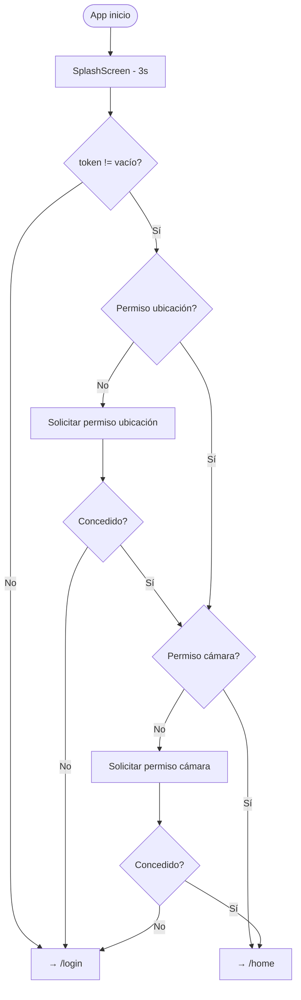

# Módulo: SplashScreen

> **Ruta:** `lib/src/pages/splashscreen_page.dart`
> **Criticidad:** 🔴 Alta
> **Estado:** Activo

## Propósito

Pantalla de arranque animada. Verifica si el usuario ya tiene un token persistido y, si es así, solicita los permisos necesarios (ubicación y cámara) antes de navegar al Home. Si no hay token, redirige al Login.

## Funcionalidades

| # | Funcionalidad | Descripción |
|---|---------------|-------------|
| 1 | Verificación de token | Lee `Preferences().token` — si no está vacío, fluye al home |
| 2 | Solicitud de permisos | Verifica `location` luego `camera` antes de navegar a `/home` |
| 3 | Animación de entrada | `AnimationController` 1000ms con `FadeAnimation` |
| 4 | Temporizador | Delay de 3 segundos antes de navegar |

## Flujo de navegación

## Dependencias

- **Depende de:** [[modulo-auth]] (navega a `/login`), [[modulo-home]] (navega a `/home`)
- **Usa:** `Preferences` (singleton token), `permission_handler ^4.0.0`

## Riesgos

- ⚠️ `permission_handler ^4.0.0` usa una API deprecada. En versiones modernas del plugin, `PermissionHandler()` ya no existe.
- ⚠️ Si los permisos se deniegan, el chofer queda en el login aunque tenga token válido.
