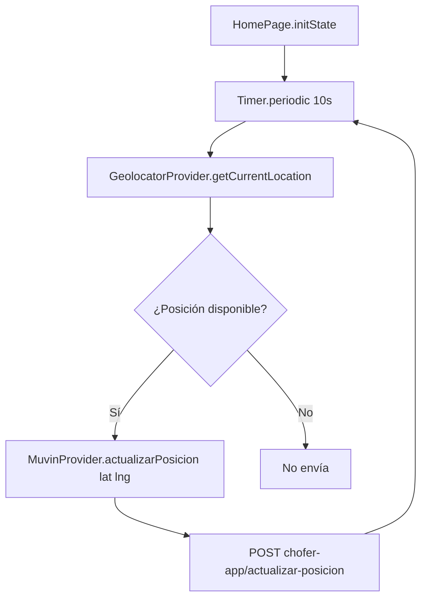

# Funcionalidad: Tracking GPS Automático

## Descripción

La app envía la posición GPS del chofer al backend cada **10 segundos** mientras la `HomePage` está activa. Es la funcionalidad de monitoreo en tiempo real del conductor.

## Implementación

```dart
// home_page.dart — initState()
Timer.periodic(Duration(seconds: 10), (timer) async {
  await _geolocatorProvider.getCurrentLocation();
  if (_geolocatorProvider.currentPosition != null) {
    await _muvinProvider.actualizarPosicion(
      _geolocatorProvider.currentPosition.latitude,
      _geolocatorProvider.currentPosition.longitude,
    );
  }
});
```

## Flujo



## Payload enviado

```json
{
  "latitud": -34.6037,
  "longitud": -58.3816
}
```

## Bug Crítico: Timer no cancelado

```dart
// ❌ No existe dispose() en HomePage que cancele el timer
// El Timer sigue corriendo aunque el widget se destruya
@override
void dispose() {
  // _timer.cancel(); ← FALTANTE
  super.dispose();
}
```

Impacto: requests HTTP continuos después de que el usuario navega fuera de `HomePage` → **memory leak** + **batería drenada** + **requests innecesarios al backend**.

## Fix Requerido

```dart
Timer? _timer; // campo de instancia

@override
void initState() {
  super.initState();
  _timer = Timer.periodic(Duration(seconds: 10), (_) async { ... });
}

@override
void dispose() {
  _timer?.cancel();
  super.dispose();
}
```

## Referencias

- [[modulo-home]]
- [[modulo-muvin-provider]]
