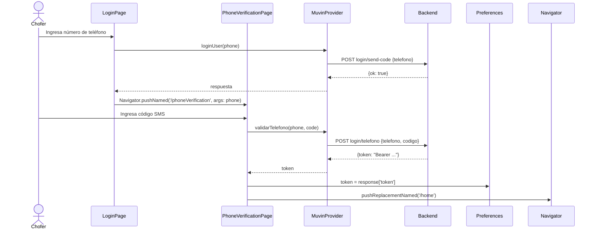

# Funcionalidad: Login por SMS

## Descripción

El chofer se autentica usando su número de teléfono. El backend envía un código SMS de verificación que el usuario debe ingresar para obtener su token de acceso.

## Flujo

## Pasos de usuario

1. Abrir la app → SplashScreen comprueba token existente
2. Si no hay token → `/login`
3. Ingresar número de teléfono → "Enviar código"
4. Recibir SMS → ingresar código de 6 dígitos
5. Si es válido → token guardado → navegar a `/home`
6. Si es inválido → mostrar error (`mostrarAlerta`)

## Datos involucrados

| Campo | Tipo | Validación |
|-------|------|------------|
| `telefono` | String | Solo numérico, longitud mínima |
| `codigo` | String | Solo numérico |
| `token` | String | Se guarda en SharedPreferences |

## Notas técnicas

- El código de país está **hardcodeado** a `'1'` (EE.UU.). El selector de país existe en el BLoC pero no está expuesto en la UI.
- El token se guarda como String plano en SharedPreferences (no cifrado).

## Referencias

- [[modulo-auth]]
- [[modulo-blocs]]
- [[modulo-muvin-provider]]
