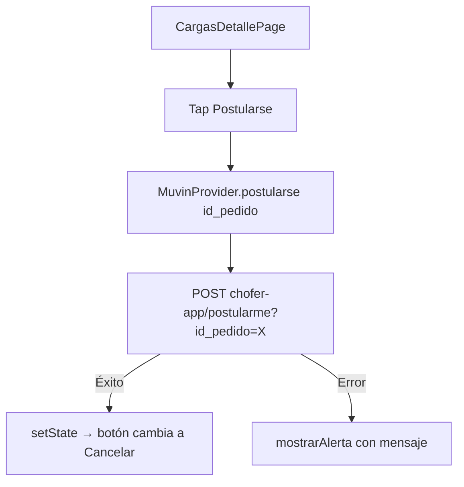
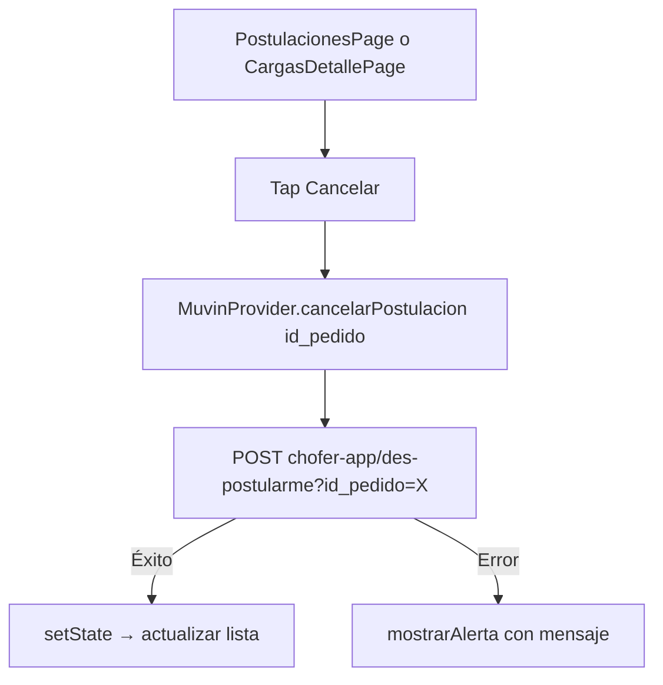

# Funcionalidad: Postulación a Carga

## Descripción

El chofer puede postularse a un pedido de transporte disponible, o cancelar una postulación previa.

## Flujo — Postularse

## Flujo — Cancelar {#cancelar}

## Restricciones

- Solo se puede postular si el chofer **no tiene un viaje activo** (controlado en `HomePage`).
- El botón de postulación se deshabilita si el campo `miViaje` tiene datos.

## Referencias

- [[modulo-cargas]]
- [[modulo-postulaciones]]
- [[modulo-muvin-provider]]
