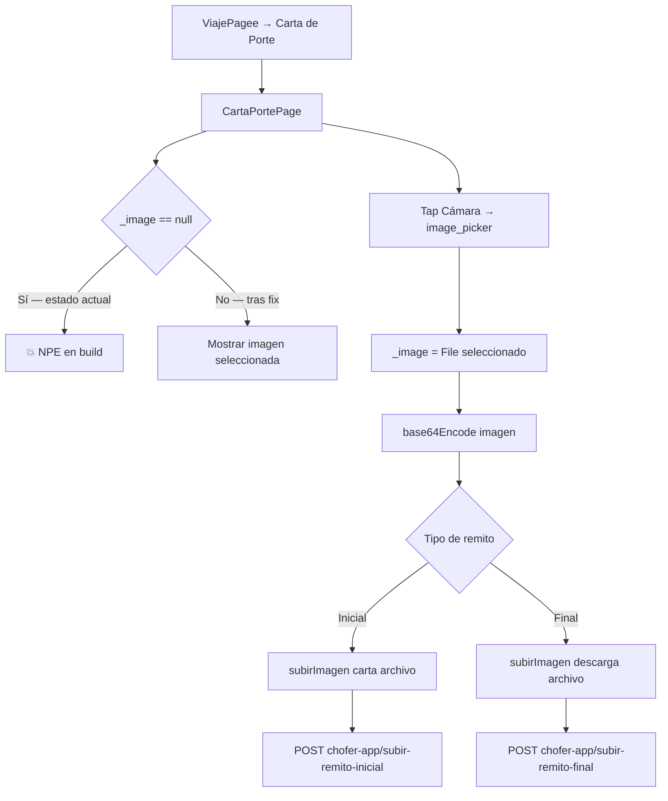

# Funcionalidad: Subir Remito / Carta de Porte

## Descripción

El chofer puede fotografiar y subir los comprobantes del viaje: remito inicial (al cargar) y remito final (al entregar). Esta funcionalidad está **actualmente rota** y no puede ser utilizada.

## Estado Actual

> 🔴 **CRASH INMEDIATO** — ver [[modulo-carta-porte]] para detalle del bug.

## Flujo Intencionado



## Payload HTTP (multipart)

```
POST /chofer-app/subir-remito-inicial
Authorization: Bearer {token}
Content-Type: multipart/form-data

archivo: [binary file]
tipo: "carta" | "descarga"
```

## Correcciones Necesarias

1. Inicializar `_image` como `File?` (nullable) con null safety.
2. Mostrar placeholder/instrucción cuando no hay imagen seleccionada.
3. Verificar `_image != null` antes de `readAsBytesSync()`.
4. Actualizar `image_picker` a versión actual (`^1.x`).
5. Procesar encoding en isolate para no bloquear UI.

## Referencias

- [[modulo-carta-porte]]
- [[modulo-viaje]]
- [[modulo-muvin-provider]]
