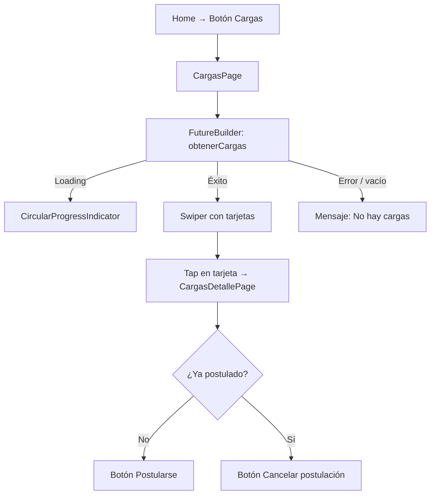

# Funcionalidad: Ver Cargas Disponibles

## Descripción

El chofer puede navegar por los pedidos de transporte públicos disponibles en un carrusel de tarjetas.

## Flujo

## Datos mostrados

Cada tarjeta muestra los campos del objeto carga:

| Campo | Descripción |
|-------|-------------|
| `nombreDestino` | Nombre del destino (reemplazado por 'XXXXXXXXXX' si vacío) |
| `fechaCarga` | Fecha de carga |
| `tipoCarga` | Tipo de mercadería |
| `peso` | Peso estimado |
| `distancia` | Distancia aproximada |

## Notas técnicas

- `FutureBuilder` crea una llamada HTTP en cada rebuild. Puede generar requests duplicados si el árbol de widgets se reconstruye.
- El carrusel usa `flutter_swiper ^1.1.6` (paquete abandonado).

## Referencias

- [[modulo-cargas]]
- [[modulo-muvin-provider]]
