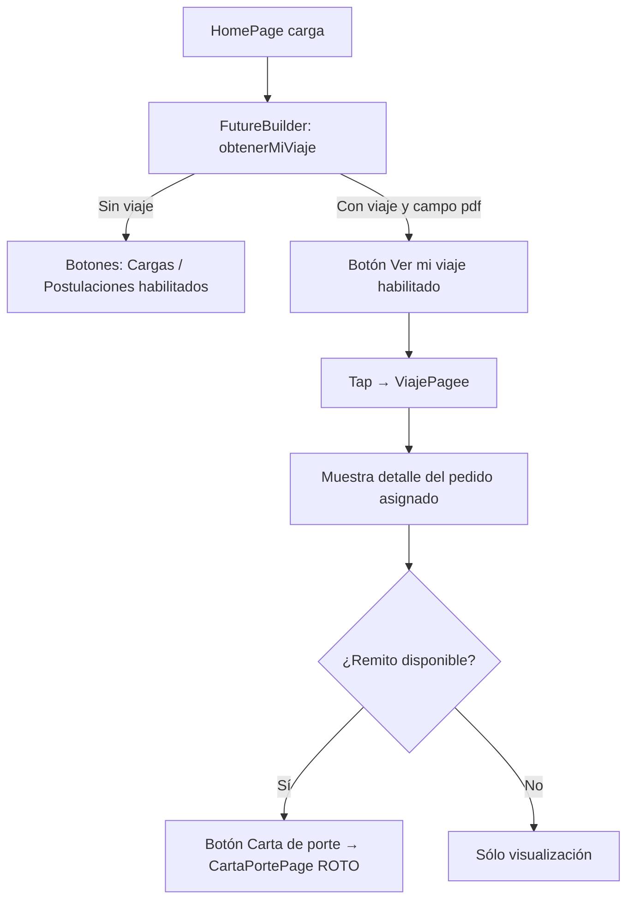

# Funcionalidad: Ver Viaje Asignado

## Descripción

Cuando el chofer tiene un viaje asignado por el operador, puede ver los detalles completos desde la `HomePage`.

## Flujo



## Lógica de habilitación de botones en HomePage

```dart
// El botón "Ver mi viaje" se habilita solo si hay datos Y tiene campo 'pdf'
bool _tieneViaje = miViaje != null && miViaje['pdf'] != null;
```

## Datos mostrados en ViajePagee

| Campo | Descripción |
|-------|-------------|
| Origen | Dirección de carga |
| Destino | Dirección de entrega |
| Fecha | Fecha programada |
| Cliente | Nombre del destinatario |
| Tipo de carga | Mercadería |
| Estado | Estado actual del pedido |

## Referencias

- [[modulo-home]]
- [[modulo-viaje]]
- [[modulo-carta-porte]] — ROTO
