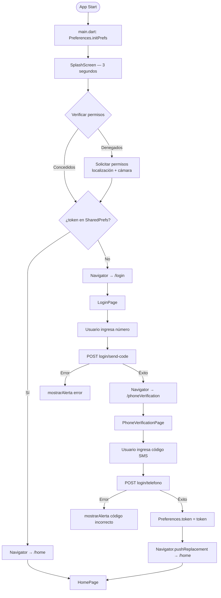

# Flujo: Arranque y Autenticación

## Diagrama Completo

## Notas

- No existe flujo de logout — el usuario no puede cerrar sesión desde la UI.
- El token no tiene fecha de expiración visible — si expira, el usuario verá errores 401 sin redirección automática.
- Los permisos se solicitan en SplashScreen sin explicación al usuario.
