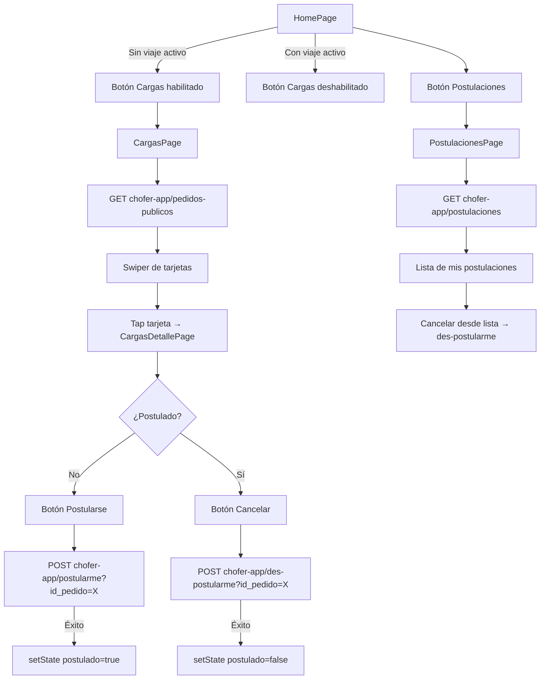

# Flujo: Ciclo de Postulación a Carga

## Diagrama

## Estado final del ciclo

Cuando el operador asigna un viaje al chofer (acción del backend), la próxima vez que `HomePage` ejecute `obtenerMiViaje()` obtendrá datos y habilitará el botón "Ver mi viaje".
