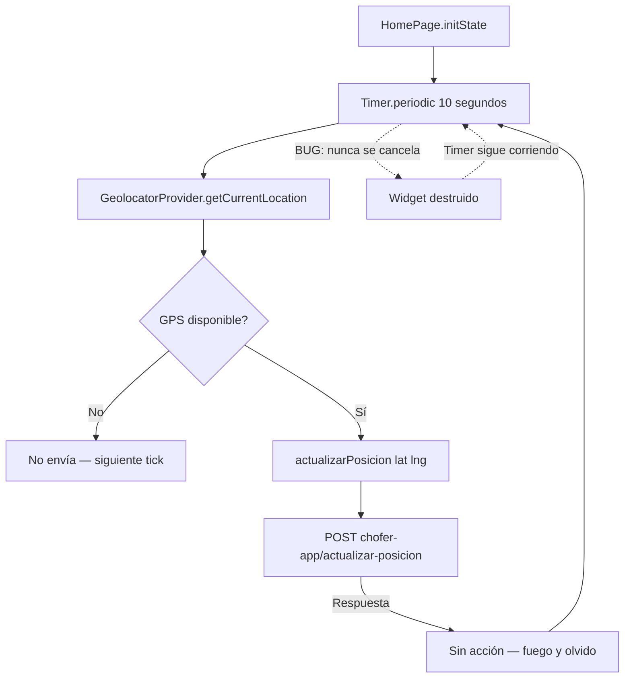

# Flujo: GPS Tracking Continuo

## Diagrama

## Ciclo de vida del Timer

| Evento | Comportamiento correcto | Comportamiento actual |
|--------|------------------------|----------------------|
| `initState` | Crear timer | ✅ Crea timer |
| Navegar fuera de Home | `dispose()` cancela timer | 🔴 **Timer NO se cancela** |
| Widget destruido | Timer detenido | 🔴 **Timer sigue activo** |
| App en background | Timer pausado | 🔴 **Puede seguir activo** |

## Impacto del bug

- Requests HTTP continuos al backend sin propósito.
- Batería del dispositivo drenada innecesariamente.
- GPS activo aunque el chofer no esté en la pantalla principal.
- Potencial acumulación de Timers si se navega múltiples veces a/desde Home.
