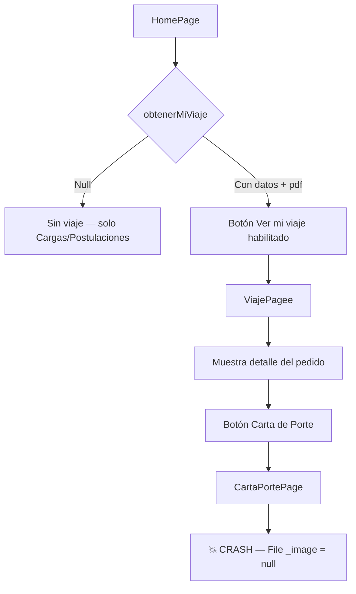
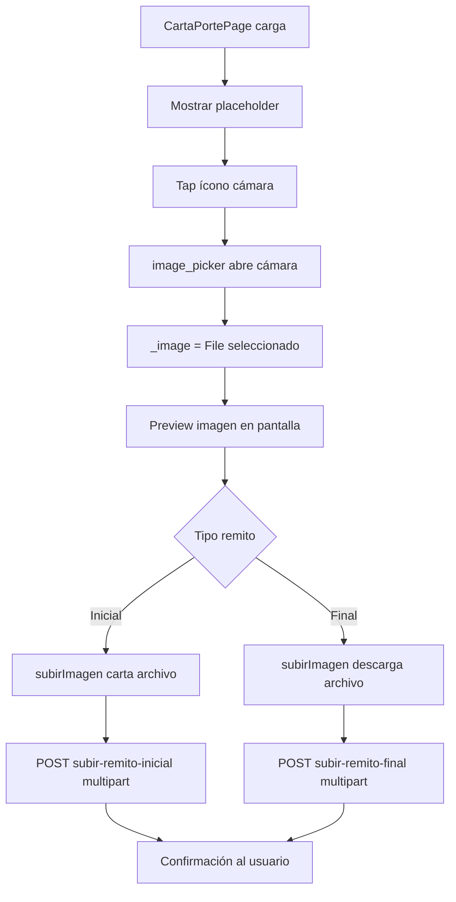

# Flujo: Viaje y Remito

## Diagrama

```mermaid
flowchart TD
    A[HomePage] --> B{obtenerMiViaje}
    B -->|Null| C[Sin viaje — solo Cargas/Postulaciones]
    B -->|Con datos + pdf| D[Botón Ver mi viaje habilitado]
    D --> E[ViajePagee]
    E --> F[Muestra detalle del pedido]
    F --> G[Botón Carta de Porte]
    G --> H[CartaPortePage]
    H --> I[💥 CRASH — File _image = null]
```

## Estado Intencionado (tras fix)

```mermaid
flowchart TD
    H[CartaPortePage carga] --> I[Mostrar placeholder]
    I --> J[Tap ícono cámara]
    J --> K[image_picker abre cámara]
    K --> L[_image = File seleccionado]
    L --> M[Preview imagen en pantalla]
    M --> N{Tipo remito}
    N -->|Inicial| O[subirImagen carta archivo]
    N -->|Final| P[subirImagen descarga archivo]
    O --> Q[POST subir-remito-inicial multipart]
    P --> R[POST subir-remito-final multipart]
    Q --> S[Confirmación al usuario]
    R --> S
```
