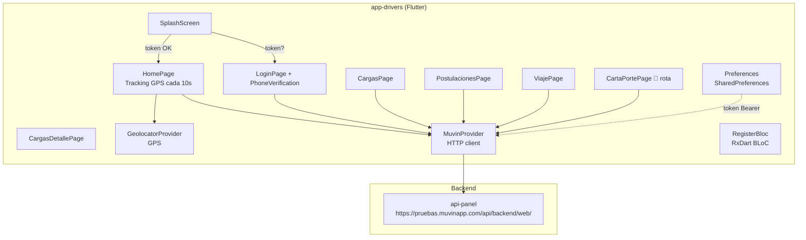

# app-drivers — Documentación Técnica

> **Proyecto:** `app-drivers` (package: `muvin_latam_app`)
> **Stack:** Flutter · Dart >=2.1.0 · BLoC (InheritedWidget manual) · HTTP · Geolocator
> **Tipo:** Aplicación móvil Android/iOS para choferes
> **Versión:** 1.0.0+1
> **Última revisión:** 2026-05-04

> **Propósito:** Aplicación móvil para los **choferes de la plataforma Muvin**. Permite ver cargas disponibles (pedidos públicos), postularse a ellas, consultar el viaje asignado, y subir fotos de remito/carta de porte. La app reporta la posición GPS del chofer cada 10 segundos al backend.

---

## Índice de secciones

| Sección | Descripción | Enlace |
|---------|-------------|--------|
| 00 · Overview | Visión general, arquitectura, stack, glosario | [00-overview/vision-general.md](./00-overview/vision-general.md) |
| 01 · Módulos | Pages, providers, BLoCs | [01-modulos/_indice-modulos.md](./01-modulos/_indice-modulos.md) |
| 02 · Funcionalidades | Casos de uso detallados | [02-funcionalidades/_indice-funcionalidades.md](./02-funcionalidades/_indice-funcionalidades.md) |
| 03 · Servicios backend | Endpoints REST consumidos | [03-servicios-backend/_indice-servicios.md](./03-servicios-backend/_indice-servicios.md) |
| 04 · Modelo de datos | Entidades y SharedPreferences | [04-modelo-de-datos/_indice-entidades.md](./04-modelo-de-datos/_indice-entidades.md) |
| 05 · Inventarios | Árbol de archivos, seguridad, dependencias | [05-inventarios/tree-estructura-archivos.md](./05-inventarios/tree-estructura-archivos.md) |
| 06 · Flujos transversales | Diagramas end-to-end | [06-flujos-transversales/_indice-flujos.md](./06-flujos-transversales/_indice-flujos.md) |
| 07 · Operación y despliegue | Build, configuración, deploy | [07-operacion-y-despliegue/_indice-operacion.md](./07-operacion-y-despliegue/_indice-operacion.md) |
| 08 · Riesgos y deuda técnica | Hotspots, deuda, modernización | [08-riesgos-y-deuda-tecnica/_indice-riesgos.md](./08-riesgos-y-deuda-tecnica/_indice-riesgos.md) |

---

## Módulos principales

| # | Módulo | Descripción breve | Criticidad | Enlace |
|---|--------|-------------------|-----------|--------|
| 1 | SplashScreen | Arranque, verificación de token y permisos | 🔴 Alta | [[modulo-splashscreen]] |
| 2 | Login / PhoneVerification | Autenticación por teléfono + código SMS | 🔴 Alta | [[modulo-auth]] |
| 3 | Home | Dashboard principal + tracking GPS | 🔴 Alta | [[modulo-home]] |
| 4 | Cargas | Listado de pedidos públicos disponibles | 🔴 Alta | [[modulo-cargas]] |
| 5 | Postulaciones | Gestión de postulaciones del chofer | 🟠 Media | [[modulo-postulaciones]] |
| 6 | Viaje | Detalle del viaje asignado | 🟠 Media | [[modulo-viaje]] |
| 7 | Carta de Porte | Subida de remito/carta de porte | 🔴 Alta (roto) | [[modulo-carta-porte]] |
| 8 | MuvinProvider | Cliente HTTP REST centralizado | 🔴 Alta | [[modulo-muvin-provider]] |
| 9 | BLoC / Provider | Gestión de estado del formulario de login | 🟡 Baja | [[modulo-blocs]] |

---

## Diagrama de arquitectura

---

## Convenciones

- 🔴 Crítico / roto / alto riesgo
- 🟠 Atención / riesgo medio
- 🟡 Bajo riesgo
- ⚠️ Advertencia puntual
- 💀 Código muerto o incompleto
- 🔒 Seguridad
