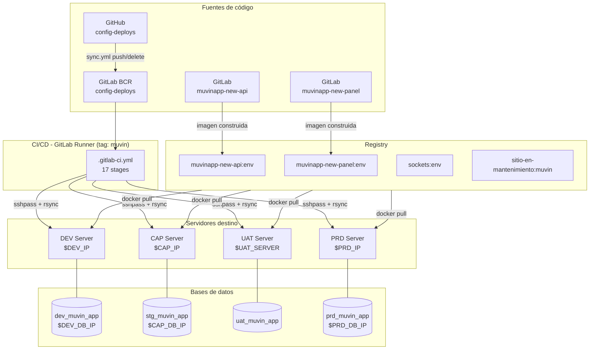

# Arquitectura de Alto Nivel — Config-Deploys Muvin

## Diagrama de capas

## Descripción de cada capa

### 📤 Fuentes de código
- **GitHub:** repositorio espejo de `config-deploys`. La sincronización con GitLab es automática via `sync.yml`.
- **GitLab BCR:** repositorio principal donde corre el pipeline. Los proyectos `muvinapp-new-api` y `muvinapp-new-panel` construyen imágenes Docker y las publican en el registry.

### 🔄 CI/CD — GitLab Runner
- Runner registrado con tag `muvin`.
- El pipeline se activa con variables `DEPLOY_AMBIENTE` (para despliegues) o `JOB_OK` (para notificaciones de nueva imagen).
- Usa `sshpass` para conectarse a los servidores destino vía SSH.

### 📦 Docker Registry
- Registry interno de BCR: `registry.bcr.com.ar`.
- Las imágenes se tagean por ambiente: `dev`, `cap`, `uat`, `prd`.

### 🖥️ Servidores destino
- Cada ambiente tiene su propio servidor Linux con Apache2, Docker, PHP y acceso SSH.
- El deploy copia archivos via `rsync` desde un contenedor Docker temporal al path `/var/www/html`.

### 🗄️ Bases de datos
| Ambiente | Base de datos | Variable host |
|----------|--------------|---------------|
| dev | `dev_muvin_app` | `$DEV_DB_IP` |
| cap | `stg_muvin_app` | `$CAP_DB_IP` |
| uat | `uat_muvin_app` | `$UAT_DB_IP` ⚠️ |
| prd | `prd_muvin_app` | `$PRD_DB_IP` |
