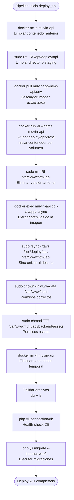

# Módulo: Deploy API

> **Stage:** `deploy_api_{env}` en [[modulo-gitlab-ci]]
> **Path destino:** `/var/www/html/api`
> **Imagen:** `registry.bcr.com.ar/muvinapp/muvinapp-new-api:{env}`
> **Criticidad:** 🔴 Alta
> **Estado:** Activo

## Propósito

Despliega el backend de Muvin (aplicación Yii2/PHP) en los servidores de cada ambiente. Usa un patrón de extracción de archivos vía contenedor Docker temporal: se hace pull de la imagen, se corre un contenedor con un volumen de sincronización, se copian los archivos al host con `rsync`, y se elimina el contenedor.

## Mecanismo de despliegue

## Variables utilizadas

| Variable | Valor (dev) | Valor (cap) | Valor (prd) | Fuente |
|----------|-------------|-------------|-------------|--------|
| `PATH_API` | `/var/www/html/api` | ídem | ídem | Job variable |
| `IMAGEN_DEPLOY` | `dev` | `cap` | `prd` | Job variable |
| `BRANCH_DEPLOY` | `cap` | `cap` | `Produccion` | Job variable |
| `DEV_USER/CAP_USER/PRD_USER` | ⚠️ secreto | ⚠️ secreto | ⚠️ secreto | GitLab CI secret |
| `DEV_PASS/CAP_PASS/PRD_PASS` | ⚠️ secreto | ⚠️ secreto | ⚠️ secreto | GitLab CI secret |
| `DEV_IP/CAP_IP/PRD_IP` | ⚠️ secreto | ⚠️ secreto | ⚠️ secreto | GitLab CI secret |

## Post-validaciones incluidas

| Job | Validación | Comando | Tipo |
|-----|-----------|---------|------|
| `2-validate_deploy_files` | Archivos presentes | `du -h --max-depth=1` + `ls -rla` | Básica |
| `3-validate_unit_test` | Conexión DB + permisos assets | `php yii connection/db` + `connection/assets-all-permissions` | Funcional (allow_failure) |
| `4-migrations` | Migraciones sin errores | `php yii migrate --interactive=0` | Crítica |
| `5-validate_deploy_api` | ⚠️ Solo whoami/id/pwd | `whoami && id && pwd` | 💀 Sin valor real |

## Riesgos y deuda técnica

- 🔴 **`chmod 777 /var/www/html/api/backend/assets`** — permisos demasiado amplios en el directorio de assets. Cualquier proceso puede escribir en ese directorio.
- ⚠️ **`BRANCH_DEPLOY` no se usa en el script** — la variable está definida pero el despliegue usa `IMAGEN_DEPLOY` (tag Docker). La variable de rama puede ser un residuo histórico.
- ⚠️ **`5-validate_deploy_api` no valida nada útil** — solo ejecuta `whoami`. No hay smoke test HTTP ni verificación de endpoint real.
- 🟡 **Migraciones sin rollback automático** — si `php yii migrate` falla a mitad, la base de datos puede quedar en estado inconsistente.

## Archivos fuente relevantes

- `.gitlab-ci.yml` — jobs `1-deploy_api-*` a `5-validate_deploy_api-*` (por cada ambiente)
- `deploy_back.sh` — versión manual del proceso (sin Docker, via git pull)
