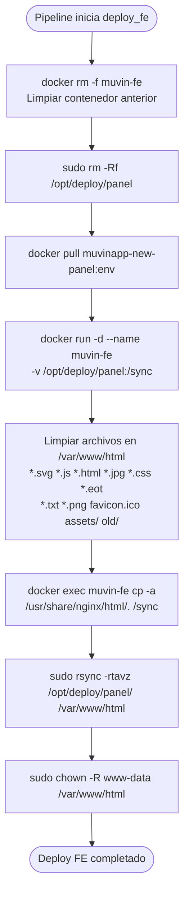

# Módulo: Deploy Frontend (Panel)

> **Stage:** `deploy_fe_{env}` en [[modulo-gitlab-ci]]
> **Path destino:** `/var/www/html`
> **Imagen:** `registry.bcr.com.ar/muvinapp/muvinapp-new-panel:{env}`
> **Criticidad:** 🟡 Media
> **Estado:** Activo

## Propósito

Despliega el frontend del panel Muvin (aplicación Vue/React compilada) en los servidores. Usa el mismo patrón que el deploy de API: contenedor Docker temporal para extracción de archivos + rsync al destino.

## Mecanismo de despliegue

## Diferencia con la imagen de API

| Aspecto | API | Frontend |
|---------|-----|---------|
| Path archivos en imagen | `/app/.` | `/usr/share/nginx/html/.` |
| Path destino | `/var/www/html/api` | `/var/www/html` |
| Archivos a limpiar | Todo `/var/www/html/api/` | Solo extensiones estáticas (.js, .html, etc.) |
| Permisos especiales | `chmod 777 assets/` | Ninguno extra |

## Riesgos y deuda técnica

- ⚠️ **Limpieza destructiva por extensión** — el script borra `*.js *.html *.css etc.` del directorio raíz. Si hay archivos con esas extensiones que no pertenecen al panel (ej: algún script custom), serán eliminados.
- ⚠️ **`2-validate_deploy_fe` solo ejecuta `whoami`** — sin smoke test real. No valida que el frontend cargue correctamente.
- 🟡 **Frontend y API comparten `/var/www/html`** — el frontend va en `/var/www/html` y la API en `/var/www/html/api`. Un deploy de FE con limpieza agresiva podría borrar archivos de la API si se configura mal la ruta.

## Archivos fuente relevantes

- `.gitlab-ci.yml` — jobs `1-deploy_fe-*` y `2-validate_deploy_fe-*` / `2-validate_deploy-*`
- `deploy_front.sh` — versión manual (via git pull + npm build)
