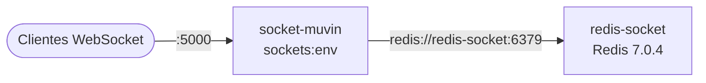
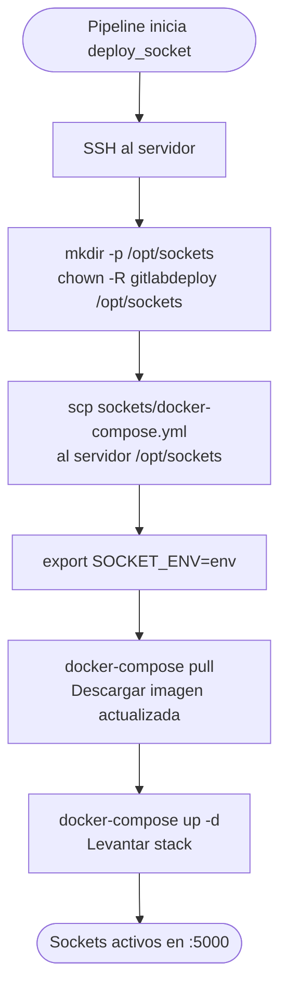

# Módulo: Deploy Sockets

> **Stage:** `deploy_socket_{env}` en [[modulo-gitlab-ci]]
> **Archivo:** `sockets/docker-compose.yml`
> **Path destino:** `/opt/sockets`
> **Imagen:** `registry.bcr.com.ar/muvinapp/sockets:{env}`
> **Criticidad:** 🟡 Media
> **Estado:** Activo (job manual)

## Propósito

Despliega el servicio de WebSockets de Muvin en los servidores destino usando Docker Compose. El servicio incluye el servidor de sockets y Redis como backend de mensajería.

## Servicios en `sockets/docker-compose.yml`

| Servicio | Imagen | Puerto | Descripción |
|----------|--------|--------|-------------|
| `socket-muvin` | `registry.bcr.com.ar/muvinapp/sockets:{SOCKET_ENV}` | `5000:5000` | Servidor de WebSockets |
| `redis-socket` | `redis:7.0.4-alpine` | — (interno) | Backend Redis para sockets |

## Proceso de deploy

## Comportamiento del job por ambiente

| Ambiente | Condición `imagen_socket_*` | Condición `DEPLOY_AMBIENTE` |
|----------|----------------------------|----------------------------|
| dev | `when: manual` | `when: manual` |
| cap | `when: always` | `when: manual` |
| uat | `when: always` | `when: manual` |
| prd | `when: manual` | `when: manual` |

> [!warning] Bloque `only:` comentado
> Los jobs `1-deploy_socket_*` tienen el bloque `only:` comentado en varios ambientes. Esto significa que el job puede aparecer en el pipeline aunque no se haya configurado la variable correspondiente. El control real es vía las `rules:`.

## Riesgos y deuda técnica

- ⚠️ **`docker-compose` (v1 CLI)** — el script usa `docker-compose` en lugar de `docker compose` (v2). En servidores modernos puede no estar instalado el binario legacy.
- 🟡 **Sin healthcheck en Redis** — el contenedor de Redis no tiene healthcheck configurado.
- ⚠️ **Puerto 5000 expuesto sin TLS** — la comunicación WebSocket está en texto plano. Se asume que hay un proxy externo que termina TLS. ⚠️ Pendiente de verificar.
- ⚠️ **`restart: always`** — a diferencia del resto del stack, este usa `always` (no `unless-stopped`). Se reiniciará incluso si se detiene manualmente.

## Archivos fuente relevantes

- `sockets/docker-compose.yml`
- `.gitlab-ci.yml` — jobs `1-deploy_socket_*`
