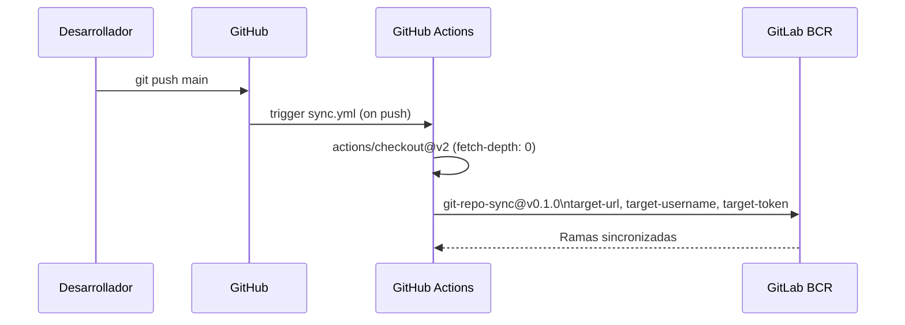

# Módulo: Sync GitHub → GitLab

> **Archivo:** `.github/workflows/sync.yml`
> **Criticidad:** 🟢 Baja
> **Estado:** Activo

## Propósito

Mantiene sincronizados los repositorios GitHub y GitLab BCR del proyecto `config-deploys`. Cada push o eliminación de rama en GitHub se replica automáticamente en GitLab, que es donde corre el pipeline de CI/CD.

## Ramas sincronizadas

- `master`
- `Produccion`
- `main`

## Mecanismo

## Variables/Secrets requeridos en GitHub

| Secret | Descripción |
|--------|-------------|
| `TARGET_URL` | URL del repositorio GitLab destino |
| `TARGET_USERNAME` | Usuario GitLab para la sincronización |
| `TARGET_TOKEN` | Token de acceso GitLab |

## Riesgos y deuda técnica

- 🟡 **`actions/checkout@v2` sin hash** — versión desactualizada. Usar `actions/checkout@v4` con hash SHA para mayor seguridad.
- 🟡 **`wangchucheng/git-repo-sync@v0.1.0` sin hash** — action de tercero sin hash fijo. Riesgo de supply chain si el tag es modificado.
- ⚠️ **Sincronización unidireccional** — solo de GitHub a GitLab. Si hay commits directamente en GitLab, no se sincronizan a GitHub y pueden perderse o generar conflictos.

## Archivos fuente relevantes

- `.github/workflows/sync.yml`
