# Módulo: Pipeline GitLab CI/CD

> **Archivo:** `.gitlab-ci.yml`
> **Líneas:** 1057
> **Runner tag:** `muvin`
> **Criticidad:** 🔴 Alta
> **Estado:** Activo en producción

## Propósito

Archivo central que define todos los stages y jobs del pipeline de despliegue de Muvin. Gestiona 4 ambientes (dev, cap, uat, prd) con una estructura repetida de fases por ambiente. Es el único punto de control del ciclo de vida de los despliegues en BCR.

## Stages definidos

```mermaid
graph LR
    G[general] --> PD[pre_deploy_dev]
    PD --> AD[deploy_api_dev]
    AD --> SD[deploy_socket_dev]
    SD --> FD[deploy_fe_dev]
    FD --> POD[post_deploy_dev]
    POD -->|manual trigger| PU[pre_deploy_uat]
    POD -->|manual trigger| PC[pre_deploy_cap]
    PC --> AC[deploy_api_cap]
    AC --> SC[deploy_socket_cap]
    SC --> FC[deploy_fe_cap]
    FC --> POC[post_deploy_cap]
    POC -->|manual trigger| PP[pre_deploy_prd]
    PU --> AU[deploy_api_uat]
    AU --> SU[deploy_socket_uat]
    SU --> FU[deploy_fe_uat]
    FU --> POU[post_deploy_uat]
    PP --> AP[deploy_api_prd]
    AP --> SP[deploy_socket_prd]
    SP --> FP[deploy_fe_prd]
    FP --> POP[post_deploy_prd]
```

## Jobs por ambiente y fase

| Stage | Job | `when` | Descripción |
|-------|-----|--------|-------------|
| `pre_deploy_*` | `1-mant_site` | `always` | Activa modo mantenimiento |
| `pre_deploy_*` | `2-backup_database` | `on_success` / `manual` (prd) | Genera dump MySQL |
| `pre_deploy_*` | `3-validate_backup_database` | `on_success` / `manual` (prd) | Valida el dump con grep |
| `deploy_api_*` | `1-deploy_api` | `on_success` / `manual` (prd) | Pull imagen + rsync API |
| `deploy_api_*` | `2-validate_deploy_files` | `on_success` / `manual` (prd) | `du` + `ls` en path API |
| `deploy_api_*` | `3-validate_unit_test` | `on_success`, `allow_failure` | `php yii connection/db` |
| `deploy_api_*` | `4-migrations` | `on_success` / `manual` (prd) | `php yii migrate` |
| `deploy_api_*` | `5-validate_deploy_api` | `on_success` / `manual` (prd) | `whoami` + `id` + `pwd` |
| `deploy_socket_*` | `1-deploy_socket` | `manual` | Docker Compose sockets |
| `deploy_fe_*` | `1-deploy_fe` | `on_success` / `manual` (prd) | Pull imagen + rsync FE |
| `deploy_fe_*` | `2-validate_deploy_fe` | `on_success` / `manual` (prd) | `whoami` |
| `post_deploy_*` | `1-sale_mantenimiento` | `on_success` / `manual` (prd) | Desactiva mantenimiento |
| `post_deploy_dev` | `2-start-deploy_to_cap` | `manual` | Trigger pipeline CAP |
| `post_deploy_cap` | `2-start-deploy_to_prd` | `manual` | Trigger pipeline PRD |

## Activación del pipeline

| Condición | Comportamiento |
|-----------|---------------|
| `$DEPLOY_AMBIENTE == 'dev'` | Ejecuta todos los jobs de dev |
| `$DEPLOY_AMBIENTE == 'cap'` | Ejecuta todos los jobs de cap |
| `$DEPLOY_AMBIENTE == 'uat'` | Ejecuta todos los jobs de uat |
| `$DEPLOY_AMBIENTE == 'prd'` | Ejecuta todos los jobs de prd |
| `$JOB_OK == 'imagen_api_dev'` | Solo re-despliega la API en dev |
| `$JOB_OK == 'imagen_panel_cap'` | Solo re-despliega el FE en cap |
| `$JOB_OK == 'imagen_socket_prd'` | Solo re-despliega sockets en prd |
| (otros `JOB_OK` combinados) | Job específico por componente y ambiente |

## Dependencias

- **Depende de:** [[modulo-deploy-api]], [[modulo-deploy-fe]], [[modulo-deploy-sockets]], [[modulo-mantenimiento]]
- **Requiere:** variables GitLab CI configuradas (ver [[requisitos-entorno]])
- **Runner:** tag `muvin` activo y con acceso a `sshpass`, Docker, `scp`

## Riesgos y deuda técnica

- 🔴 **sshpass con contraseña en variable** — vector de exposición de credenciales. Ver [[security-inventory#SEC-001]].
- 🟡 **Pipeline de 1057 líneas con alta repetición** — la misma estructura de jobs se repite 4 veces (dev/cap/uat/prd). Candidato a refactor con `extends` o `!reference` de GitLab CI.
- ⚠️ **`$JOB_OK == 'imagen_socket_*'` con condición comentada** — los jobs de socket tienen el bloque `only:` comentado, lo que puede causar que se ejecuten en condiciones inesperadas.
- ⚠️ **`5-validate_deploy_api`** — el job de validación solo ejecuta `whoami`, `id`, `pwd`. No hay validación real de la API.
- ⚠️ **`2-validate_deploy_fe`** — ídem, solo `whoami`. Sin smoke test real.
- 🟡 **Typo en nombre de backup** — job `3-validate_backup_datebase` (debería ser `database`). Indica bajo mantenimiento del pipeline.
- ⚠️ **`DEPLOY_TOKEN` hardcoded al proyecto 200** — `https://gitlab.bcr.com.ar/api/v4/projects/200/trigger/pipeline`. Si el project ID cambia, el encadenamiento falla.

## Archivos fuente relevantes

- `.gitlab-ci.yml` — archivo completo del pipeline
