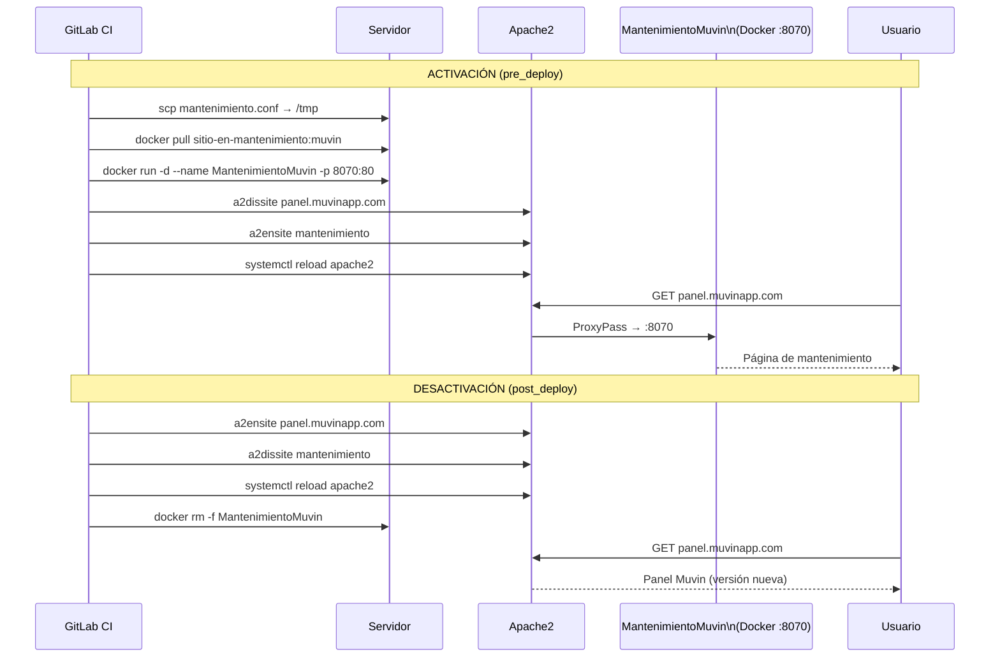

# Módulo: Modo Mantenimiento

> **Stage:** `pre_deploy_{env}` (activación) y `post_deploy_{env}` (desactivación)
> **Archivo de config:** `conf/mantenimiento/mantenimiento.conf`
> **Imagen Docker:** `registry.bcr.com.ar/docker/sitio-en-mantenimiento:muvin`
> **Puerto:** `8070`
> **Criticidad:** 🟡 Media

## Propósito

Pone el sitio en "mantenimiento" durante el proceso de despliegue para evitar que los usuarios vean errores o versiones inconsistentes. Utiliza un VirtualHost de Apache que hace proxy al contenedor Docker del sitio de mantenimiento.

## Mecanismo



## Contenido de `mantenimiento.conf`

```apache
<VirtualHost *:80>
    ProxyPass / http://127.0.0.1:8070/
    ProxyPassReverse / http://127.0.0.1:8070/
    ErrorLog ${APACHE_LOG_DIR}/error.log
    CustomLog ${APACHE_LOG_DIR}/access.log combined
</VirtualHost>
```

> [!warning] VirtualHost sin ServerName
> El archivo `mantenimiento.conf` no tiene `ServerName` definido. Apache lo usará como VirtualHost de último recurso, lo que podría interceptar requests inesperados si hay otros VirtualHosts mal configurados.

## Riesgos y deuda técnica

- ⚠️ **`when: always` en activación** — el job `1-mant_site` se ejecuta siempre, incluso si un job previo del pipeline falló. Esto asegura que el mantenimiento se active, pero puede dejar el sitio en mantenimiento si el pipeline no llega al `post_deploy`.
- 🔴 **Riesgo de sitio bloqueado en mantenimiento** — si el pipeline falla después del `pre_deploy` y antes del `post_deploy`, el sitio queda en mantenimiento indefinidamente hasta intervención manual.
- ⚠️ **`sudo cp` al directorio de Apache** — el script copia `mantenimiento.conf` a `/etc/apache2/sites-available/` con `sudo`. Requiere que el usuario SSH tenga privilegios sudo sin contraseña para esta operación.

## Archivos fuente relevantes

- `conf/mantenimiento/mantenimiento.conf`
- `.gitlab-ci.yml` — jobs `1-mant_site-*` y `1-sale_mantenimiento-*`
