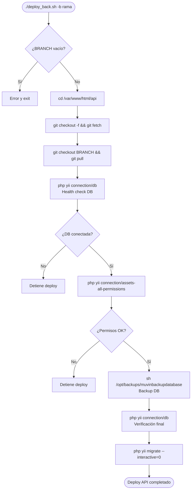
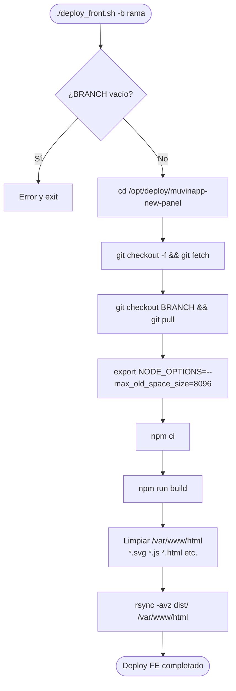

# Módulo: Scripts Manuales de Deploy

> **Archivos:** `deploy_back.sh`, `deploy_front.sh`
> **Criticidad:** 🟢 Baja
> **Estado:** Disponibles (uso en emergencias o fuera del pipeline)

## Propósito

Scripts Bash alternativos al pipeline GitLab CI. Permiten realizar despliegues de forma manual directamente en el servidor, sin pasar por CI/CD. Útiles en situaciones de emergencia, acceso limitado a GitLab o necesidad de deploy rápido.

---

## `deploy_back.sh` — Deploy manual de API

**Path de trabajo:** `/var/www/html/api`
**Mecanismo:** git pull directo (no usa Docker)



**Uso:**
```bash
./deploy_back.sh -b cap
./deploy_back.sh -b Produccion
```

> [!warning] Diferencia con el pipeline
> Este script trabaja con git pull directo sobre `/var/www/html/api`, sin usar imágenes Docker. Requiere que el repositorio esté clonado en esa ruta en el servidor. En el pipeline, los archivos provienen de una imagen Docker. Los dos métodos pueden resultar en versiones distintas si no se sincroniza el tag Docker con el branch.

---

## `deploy_front.sh` — Deploy manual de Frontend

**Path del repo:** `/opt/deploy/muvinapp-new-panel`
**Path destino:** `/var/www/html`
**Mecanismo:** git pull + npm build + rsync



**Uso:**
```bash
./deploy_front.sh -b cap
./deploy_front.sh -b Produccion
```

## Riesgos y deuda técnica

- ⚠️ **`deploy_back.sh` modifica `/var/www/html/api` directamente** — sin staging intermedio. Si el build falla a mitad, la aplicación queda en estado inconsistente.
- ⚠️ **`deploy_front.sh` requiere Node.js en el servidor** — para compilar el frontend. En el pipeline normal, la compilación ocurre durante el build de la imagen Docker, no en el servidor destino.
- 🟡 **`NODE_OPTIONS=--max_old_space_size=8096`** — necesita 8GB de heap para el build del frontend. Indica una aplicación frontend grande o con configuración de memoria no optimizada.
- ⚠️ **`/opt/backups/muvinbackupdatabase`** — referencia a un script externo no versionado en este repositorio. Si no existe en el servidor, el deploy se interrumpe.

## Archivos fuente relevantes

- `deploy_back.sh`
- `deploy_front.sh`
