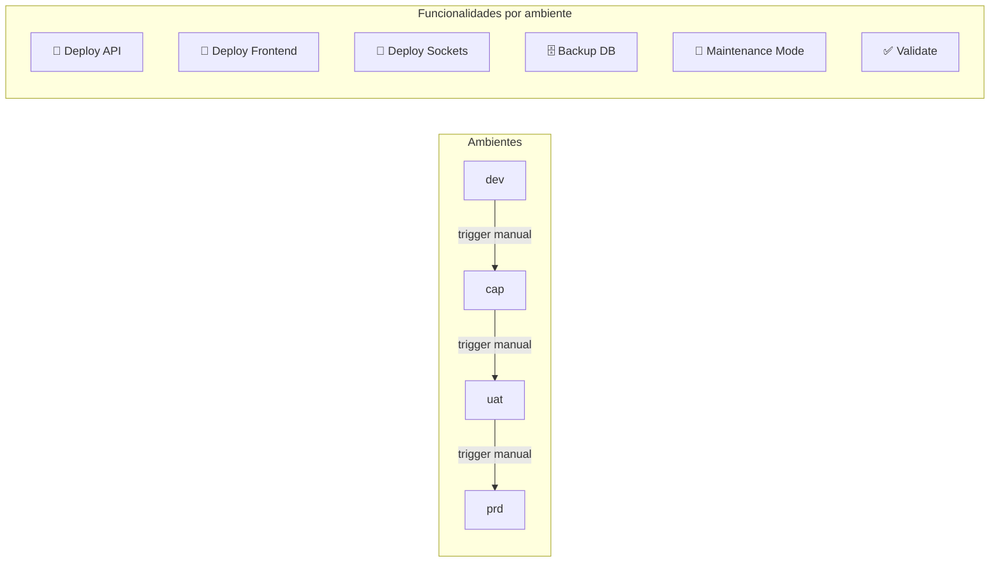

# Índice de Funcionalidades — Config-Deploys Muvin

> Funcionalidades que el sistema de CI/CD provee al ecosistema Muvin.

## Funcionalidades documentadas

| Archivo | Funcionalidad | Estado |
|---------|--------------|--------|
| [[funcionalidad-deploy-automatico]] | Deploy automático por push de rama | ✅ Activo |
| [[funcionalidad-backup-database]] | Backup de base de datos pre-deploy | ✅ Activo |
| [[funcionalidad-maintenance-mode]] | Modo mantenimiento durante deploys | ✅ Activo |
| [[funcionalidad-promocion-ambientes]] | Promoción manual entre ambientes | ✅ Activo |
| [[funcionalidad-deploy-sockets]] | Deploy del servicio de sockets | ✅ Activo |
| [[funcionalidad-sync-github-gitlab]] | Sincronización de repos GitHub ↔ GitLab | ✅ Activo |

## Mapa de funcionalidades por ambiente

## Referencias

- [[_indice-modulos]]
- [[_indice-flujos]]
