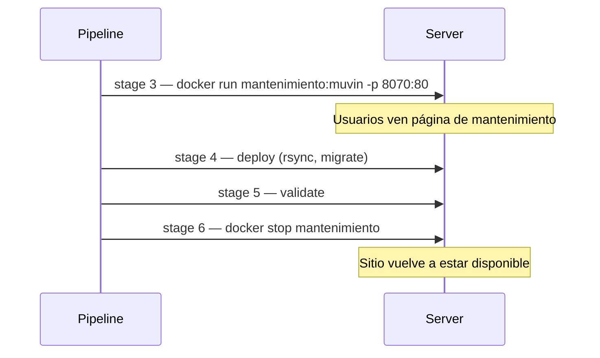

# Funcionalidad: Modo Mantenimiento

## Descripción

Durante el deploy se activa una página de mantenimiento para que los usuarios no vean el sitio en estado inconsistente. El flujo es: **encender mantenimiento → deploy → apagar mantenimiento**.

## Mecanismo

Se despliega un contenedor Docker con la imagen `registry.bcr.com.ar/docker/sitio-en-mantenimiento:muvin` que expone la página en el puerto **8070** del servidor. Apache actúa como proxy reverso hacia ese puerto mediante un VirtualHost.

```
Usuario → Nginx/Apache (80/443) → proxy_pass → localhost:8070 → contenedor mantenimiento
```

## Configuración Apache

```apache
# conf/mantenimiento/mantenimiento.conf
<VirtualHost *:80>
    ProxyPreserveHost On
    ProxyPass / http://localhost:8070/
    ProxyPassReverse / http://localhost:8070/
</VirtualHost>
```

> [!note]
> El VirtualHost no tiene `ServerName` definido, por lo que captura cualquier request que llegue al puerto 80 sin nombre de host coincidente. Ver [[deuda-tecnica]] ítem DT-09.

## Stages involucrados

| Stage | Acción |
|-------|--------|
| `3-maintenance_on_*` | Levanta el contenedor de mantenimiento |
| `6-maintenance_off_*` | Detiene el contenedor de mantenimiento |

## Flujo completo



## Riesgo

> [!danger]
> Si el pipeline falla en cualquier stage entre `3` y `6`, el modo mantenimiento **queda activo indefinidamente**. No hay mecanismo automático de timeout ni rollback que apague el contenedor. Requiere intervención manual.

## Referencias

- [[modulo-mantenimiento]]
- [[flujo-deploy-completo]]
- [[deuda-tecnica]] — DT-09
