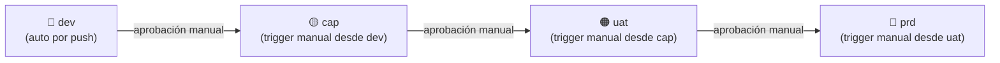

# Funcionalidad: Promoción entre Ambientes

## Descripción

Los deploys a `cap`, `uat` y `prd` no se disparan directamente por push de código. Se activan mediante **triggers manuales** desde el pipeline del ambiente anterior, formando una cadena de promoción controlada.

## Cadena de promoción



## Configuración del trigger en .gitlab-ci.yml

```yaml
# Trigger al finalizar el pipeline de dev
trigger_cap:
  stage: trigger
  trigger:
    project: softcomsas/config-deploys   # project ID: 200
    branch: cap
    strategy: depend
  when: manual
  only:
    - dev
```

> [!warning]
> El project ID `200` está hardcodeado en el pipeline. Ver [[deuda-tecnica]] ítem DT-05 para externalizarlo como variable.

## Requisitos para promover

1. El pipeline del ambiente anterior debe haber finalizado **verde**.
2. Un usuario con permisos de `Maintainer` o superior en GitLab debe hacer clic en el botón de trigger manual.
3. Las variables de entorno del ambiente destino deben estar configuradas en GitLab CI/CD Settings.

## Diferencias entre ambientes desplegados

| Variable | dev | cap | uat | prd |
|----------|-----|-----|-----|-----|
| Base de datos | `dev_muvin_app` | `cap_muvin_app` | `uat_muvin_app` | `prd_muvin_app` |
| Imagen tag | `:dev` | `:cap` | `:uat` | `:prd` |
| Ruta deploy | `/var/www/html` | `/var/www/html` | `/var/www/html` | `/var/www/html` |

## Referencias

- [[flujo-promocion-ambientes]]
- [[modulo-gitlab-ci]]
- [[deuda-tecnica]] — DT-05
