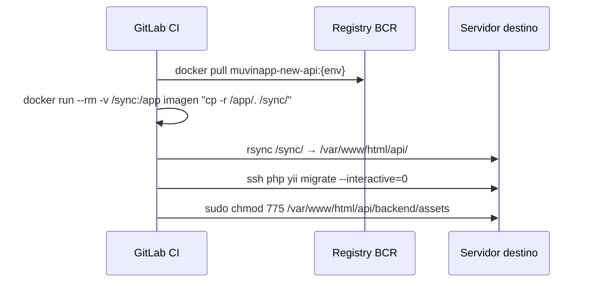

# Servicio: API Backend (Yii2/PHP)

## Descripción

Backend principal de la plataforma Muvin. Desarrollado en Yii2/PHP. El pipeline de config-deploys extrae la imagen Docker y sincroniza los artefactos al servidor destino mediante rsync.

## Imagen Docker

```
registry.bcr.com.ar/muvinapp/muvinapp-new-api:{env}
```

| Tag | Ambiente |
|-----|----------|
| `:dev` | Desarrollo |
| `:cap` | Capacitación |
| `:uat` | UAT |
| `:prd` | Producción |

## Cómo se despliega



## Ruta de deploy en servidor

```
/var/www/html/api/
```

## Post-deploy

- Se ejecutan migraciones de base de datos con `php yii migrate --interactive=0`.
- Se corrigen permisos del directorio `backend/assets` (actualmente `777`, deuda DT-02).

## Variables de entorno requeridas

| Variable | Descripción |
|----------|-------------|
| `*_USER` | Usuario SSH del servidor |
| `*_IP` | IP del servidor |
| `*_PASS` | Contraseña SSH (candidato a eliminar) |
| `*_DB_IP` | IP de la base de datos |
| `*_DB_USER` | Usuario de base de datos |
| `*_DB_PASS` | Contraseña de base de datos |
| `DEPLOY_TOKEN` | Token de acceso al registry BCR |

## Repositorio fuente

> Este repo **no contiene** el código del API. El código fuente está en el repositorio `muvinapp-new-api` (o similar) que genera la imagen Docker publicada en el registry.

## Referencias

- [[modulo-deploy-api]]
- [[funcionalidad-deploy-automatico]]
- [[deuda-tecnica]] — DT-01, DT-02, DT-03
