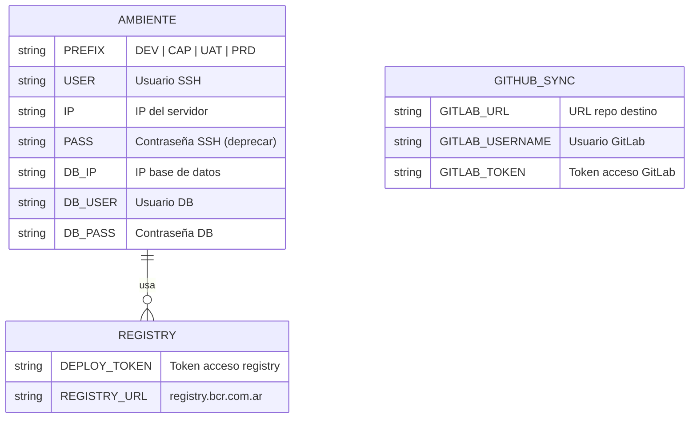

# Modelo de Datos — Config-Deploys Muvin

> [!info] Esta sección aplica de forma adaptada
> Config-deploys **no tiene base de datos propia**. No hay entidades, tablas ni ORM en este repositorio. Sin embargo, el pipeline gestiona un "modelo de configuración" a través de variables de entorno y archivos de configuración que se documentan aquí.

## Esquema de variables de entorno (por ambiente)

Cada ambiente replica el mismo conjunto de variables con prefijo diferente (`DEV_`, `CAP_`, `UAT_`, `PRD_`).

## Variables globales (sin prefijo de ambiente)

| Variable | Tipo | Descripción |
|----------|------|-------------|
| `DEPLOY_TOKEN` | Secret | Token de acceso al registry BCR |

## Variables por ambiente

| Variable | Ejemplo (dev) | Descripción |
|----------|--------------|-------------|
| `DEV_USER` | `deploy` | Usuario SSH del servidor |
| `DEV_IP` | `10.0.0.10` | IP del servidor de desarrollo |
| `DEV_PASS` | `***` | Contraseña SSH ⚠️ (ver DT-01) |
| `DEV_DB_IP` | `10.0.0.11` | IP de la base de datos |
| `DEV_DB_USER` | `muvin_user` | Usuario de base de datos |
| `DEV_DB_PASS` | `***` | Contraseña de base de datos ⚠️ (ver DT-03) |

> El mismo patrón se repite para `CAP_*`, `UAT_*` y `PRD_*`.

## Archivos de configuración versionados

| Archivo | Contenido | Sensible |
|---------|-----------|---------|
| `.gitlab-ci.yml` | Definición completa del pipeline | No |
| `sockets/docker-compose.yml` | Stack de sockets + Redis | No |
| `conf/mantenimiento/mantenimiento.conf` | VirtualHost Apache de mantenimiento | No |
| `.github/workflows/sync.yml` | Workflow de sincronización | No |

## Referencias

- [[stack-tecnologico]]
- [[requisitos-entorno]]
- [[deuda-tecnica]] — DT-01, DT-03
