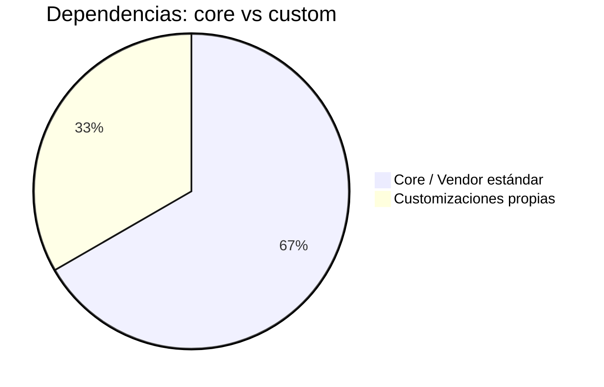

# Core vs Dependencias Customizadas — Config-Deploys Muvin

## Dependencias "core / vendor estándar"

| Dependencia | Versión | Propósito | Alternativa moderna | Bloqueada? |
|-------------|---------|-----------|---------------------|-----------|
| GitLab CI/CD | (BCR self-hosted) | Orquestación del pipeline | GitHub Actions / Jenkins / ArgoCD | 🟡 Depende de infraestructura BCR |
| Docker | Sistema | Pull/run de imágenes | Podman | 🟢 No bloqueada |
| Docker Compose (v1 CLI) | Sistema | Stack de sockets | `docker compose` v2 (plugin) | 🟡 Depende de versión instalada en servidores |
| `sshpass` | Sistema | Conexión SSH con contraseña | Clave SSH en GitLab CI secrets | 🟡 No bloqueada — cambio de práctica recomendado |
| `rsync` | Sistema | Copia de archivos | — | 🟢 Estándar |
| Apache2 | Sistema | Servidor web + mantenimiento | Nginx | 🟡 Depende de configuración del servidor |
| `mysqldump` | Sistema | Backup de base de datos | mysqldump sigue siendo estándar | 🟢 Vigente |
| `actions/checkout@v2` | v2 | Checkout en GitHub Actions | `actions/checkout@v4` | 🟢 No bloqueada — actualización simple |
| `wangchucheng/git-repo-sync@v0.1.0` | v0.1.0 | Sync GitHub→GitLab | Acción más mantenida o script propio | 🟡 Depende del mantenimiento del proyecto |
| Redis | `7.0.4-alpine` | Backend sockets | Versión actual | 🟢 Vigente |

## Customizaciones propias

| Customización | Archivo | Descripción | Riesgo |
|---------------|---------|-------------|--------|
| Pipeline multi-ambiente | `.gitlab-ci.yml` (1057 líneas) | Estructura custom con 17 stages y variables condicionales | 🟡 Alta complejidad y repetición |
| `mantenimiento.conf` | `conf/mantenimiento/mantenimiento.conf` | VirtualHost Apache custom para modo mantenimiento | 🟢 Simple |
| `deploy_back.sh` | `deploy_back.sh` | Script Bash de deploy manual con health checks Yii2 | 🟡 Dependencia de rutas hardcodeadas |
| `deploy_front.sh` | `deploy_front.sh` | Script Bash de build y deploy frontend | 🟡 Requiere Node.js en servidor destino |
| Patrón "contenedor efímero para extracción" | `.gitlab-ci.yml` | Usa Docker run + volumen para extraer archivos de imagen | 🟢 Funcional pero poco común |

## Resumen

> [!info] El core no está bloqueado
> Ninguna dependencia core está técnicamente bloqueada. Las principales mejoras son de práctica (reemplazar `sshpass` por claves SSH, actualizar GitHub Actions a versiones con hash) y de mantenibilidad (refactorizar el pipeline con `extends` o templates).
