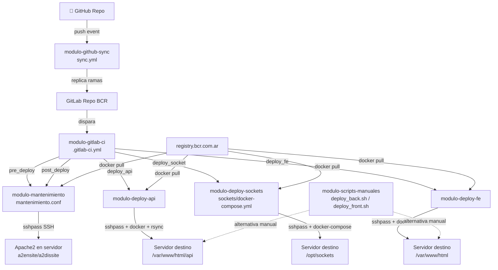

# Dependencias entre Módulos — Config-Deploys Muvin

## Diagrama de dependencias

## Descripción de dependencias

| Origen | Destino | Tipo | Descripción |
|--------|---------|------|-------------|
| GitHub | modulo-github-sync | Evento (push/delete) | Un push a `main`/`master`/`Produccion` en GitHub dispara la sincronización |
| modulo-github-sync | GitLab BCR | Replicación Git | El workflow copia las ramas al repositorio GitLab |
| GitLab BCR | modulo-gitlab-ci | Trigger de pipeline | Un pipeline se inicia con variables `DEPLOY_AMBIENTE` o `JOB_OK` |
| modulo-gitlab-ci | modulo-mantenimiento | Invocación de etapa | pre/post_deploy activan y desactivan el modo mantenimiento |
| modulo-gitlab-ci | modulo-deploy-api | Invocación de etapa | La etapa `deploy_api_*` ejecuta el deploy del backend |
| modulo-gitlab-ci | modulo-deploy-sockets | Invocación de etapa | La etapa `deploy_socket_*` ejecuta el deploy de sockets |
| modulo-gitlab-ci | modulo-deploy-fe | Invocación de etapa | La etapa `deploy_fe_*` ejecuta el deploy del frontend |
| modulo-deploy-api | registry.bcr.com.ar | Pull de imagen Docker | Descarga `muvinapp-new-api:{env}` |
| modulo-deploy-fe | registry.bcr.com.ar | Pull de imagen Docker | Descarga `muvinapp-new-panel:{env}` |
| modulo-deploy-sockets | registry.bcr.com.ar | Pull de imagen Docker | Descarga `sockets:{env}` |
| modulo-scripts-manuales | Servidor destino | SSH + git + rsync | Alternativa manual al pipeline; sin Docker |
