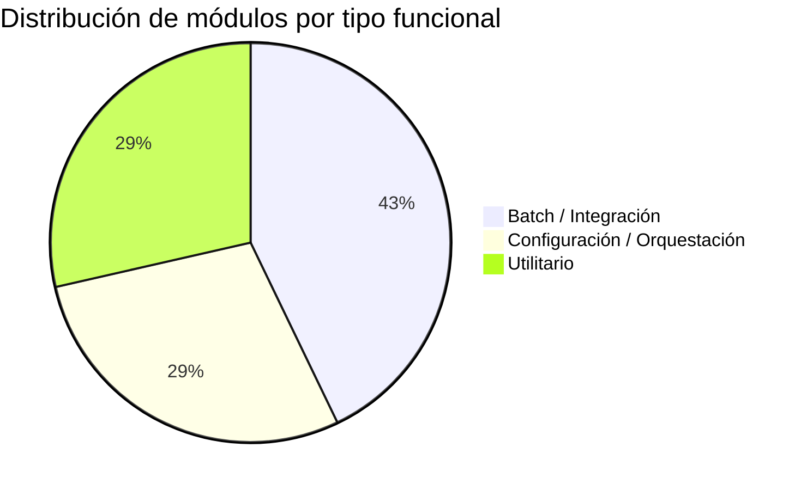

# Clasificación Funcional — Config-Deploys Muvin

## Tabla de clasificación

| Módulo | Tipo funcional | Descripción |
|--------|---------------|-------------|
| [[modulo-gitlab-ci]] | Configuración / Orquestación | Define y coordina el ciclo completo de CI/CD |
| [[modulo-deploy-api]] | Batch / Integración | Proceso automatizado de extracción y despliegue del backend |
| [[modulo-deploy-fe]] | Batch / Integración | Proceso automatizado de extracción y despliegue del frontend |
| [[modulo-deploy-sockets]] | Configuración / Integración | Levanta stack Docker Compose de sockets y Redis |
| [[modulo-mantenimiento]] | Utilitario / Seguridad | Activa/desactiva la página de mantenimiento durante deploys |
| [[modulo-scripts-manuales]] | Utilitario | Scripts de emergencia para deploy manual sin pipeline |
| [[modulo-github-sync]] | Integración | Sincronización automática entre repositorios GitHub y GitLab |

## Distribución por tipo funcional

## Clasificación de jobs del pipeline

| Categoría | Cantidad de jobs | Descripción |
|-----------|-----------------|-------------|
| Pre-deploy (mantenimiento + backup) | 12 (3 × 4 ambientes) | Preparación del servidor |
| Deploy API | 20 (5 × 4 ambientes) | Extracción y validación del backend |
| Deploy Sockets | 4 (1 × 4 ambientes) | Stack de sockets |
| Deploy Frontend | 8 (2 × 4 ambientes) | Extracción del panel |
| Post-deploy | 8 (2 × 4 ambientes) | Restauración + trigger siguiente ambiente |
| General (notificaciones) | 6 | Notificaciones de nueva imagen por componente |
| **Total** | **~58 jobs** | |
