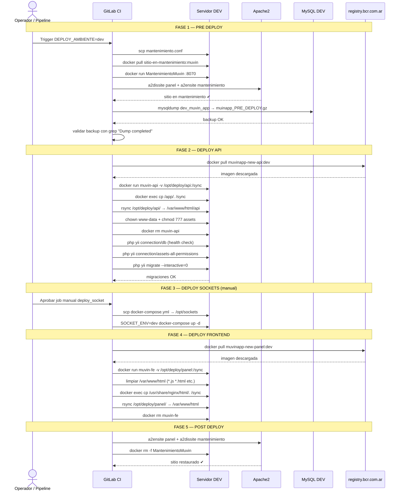

# Flujo: Deploy Completo (ejemplo en DEV)

> **Módulos:** [[modulo-gitlab-ci]] → [[modulo-mantenimiento]] → [[modulo-deploy-api]] → [[modulo-deploy-sockets]] → [[modulo-deploy-fe]] → [[modulo-mantenimiento]]

## Diagrama de secuencia



## Duración estimada por fase

| Fase | Duración aprox. | Observaciones |
|------|----------------|---------------|
| Pre-deploy (mantenimiento + backup) | 2-5 min | Depende del tamaño de la DB |
| Deploy API | 3-8 min | Depende del peso de la imagen y velocidad de red |
| Deploy Sockets | 1-3 min | Solo si se aprueba manualmente |
| Deploy Frontend | 2-5 min | Depende del peso de la imagen |
| Post-deploy | < 1 min | |
| **Total** | **8-22 min** | Sin contar tiempo de espera en manuals |

## Riesgo: sitio bloqueado en mantenimiento

> [!danger] Punto de falla crítico
> Si el pipeline falla entre el `pre_deploy` y el `post_deploy`, el sitio queda en mantenimiento indefinidamente. Se requiere intervención manual para restaurarlo:
> ```bash
> sudo a2ensite panel.muvinapp.com
> sudo a2dissite mantenimiento
> sudo systemctl reload apache2
> docker rm -f MantenimientoMuvin
> ```
