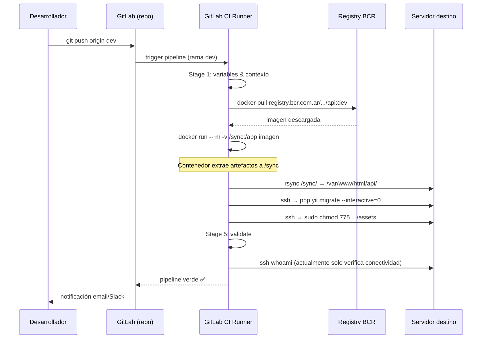

# Flujo: Nueva imagen Docker → Deploy automático

> Describe el ciclo de vida completo desde que se hace push de código hasta que la nueva imagen queda corriendo en el ambiente destino.

## Diagrama de flujo



## Etapas del pipeline involucradas

| Stage | Job | Qué hace |
|-------|-----|----------|
| `1-images` | `1-images_*` | Descarga imagen del registry |
| `2-backup_database` | `2-backup_database_*` | Dump de base de datos previo |
| `3-maintenance_on` | `3-maintenance_on_*` | Activa página de mantenimiento |
| `4-deploy_api` | `4-deploy_api_*` | rsync artefactos + migrate |
| `4-deploy_fe` | `4-deploy_fe_*` | rsync frontend |
| `4-deploy_sockets` | `4-deploy_sockets_*` | docker-compose up en sockets |
| `5-validate` | `5-validate_*` | Verificación post-deploy |
| `6-maintenance_off` | `6-maintenance_off_*` | Desactiva mantenimiento |

## Variables de entorno requeridas

```
*_USER       — usuario SSH del servidor
*_IP         — IP del servidor
*_PASS       — contraseña SSH (candidato a eliminar en DT-01)
*_DB_IP      — IP de base de datos
*_DB_USER    — usuario de base de datos
*_DB_PASS    — contraseña de base de datos
DEPLOY_TOKEN — token de acceso al registry
```

## Precondiciones

- La imagen `:{env}` ya fue publicada en el registry por el pipeline de build del repo correspondiente.
- El servidor destino tiene instalados: `rsync`, `docker`, `php`, acceso `sudo` para el usuario CI.
- La rama que hace trigger coincide con el ambiente (ej: rama `dev` → ambiente dev).

## Postcondiciones

- Los artefactos están sincronizados en `/var/www/html/`.
- Las migraciones de base de datos fueron ejecutadas.
- La página de mantenimiento está desactivada.
- El job de validación retornó exit 0.

## Referencias

- [[modulo-gitlab-ci]]
- [[flujo-deploy-completo]]
- [[modulo-deploy-api]] · [[modulo-deploy-fe]] · [[modulo-deploy-sockets]]
