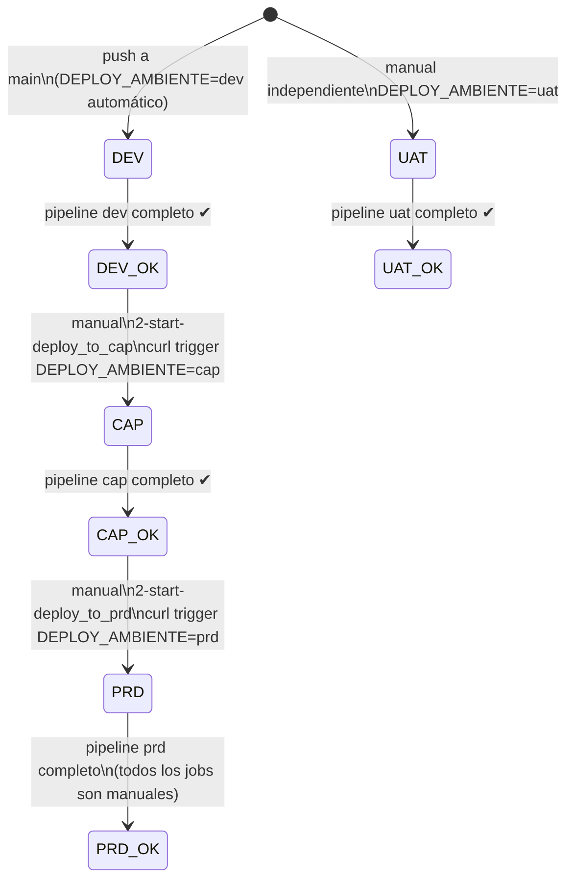

# Flujo: Promoción entre Ambientes

> **Módulo:** [[modulo-gitlab-ci]]

## Diagrama de promoción



## Mecanismo de trigger entre ambientes

```yaml
# Post deploy DEV → trigger CAP
script:
  - curl -X POST -F token=$DEPLOY_TOKEN -F ref=main
    --form "variables[DEPLOY_AMBIENTE]=cap"
    "https://gitlab.bcr.com.ar/api/v4/projects/200/trigger/pipeline"
when: manual
```

## Comportamiento por ambiente

| Ambiente | Activación | Jobs | Siguiente paso |
|----------|-----------|------|---------------|
| **dev** | Automático (`DEPLOY_AMBIENTE=dev`) | `on_success` (excepto sockets=manual) | Manual → trigger cap |
| **cap** | Manual (trigger desde dev post_deploy) | `on_success` (excepto sockets=manual) | Manual → trigger prd |
| **uat** | Manual independiente | `on_success` (excepto sockets=manual) | No hay trigger automático |
| **prd** | Manual (trigger desde cap post_deploy) | Todos `when: manual` | — |

## Riesgos

- ⚠️ **Project ID `200` hardcodeado** — si el proyecto GitLab migra o cambia ID, los triggers de promoción fallan.
- 🟡 **UAT desacoplado del flujo** — UAT no está en la cadena DEV→CAP→PRD. Puede ejecutarse en paralelo con cualquier otro ambiente.
- ⚠️ **No hay gate de calidad** — la promoción de dev a cap se hace manualmente sin requerir que ningún test pase. El trigger `2-start-deploy_to_cap` solo necesita que `post_deploy_dev` esté disponible.
