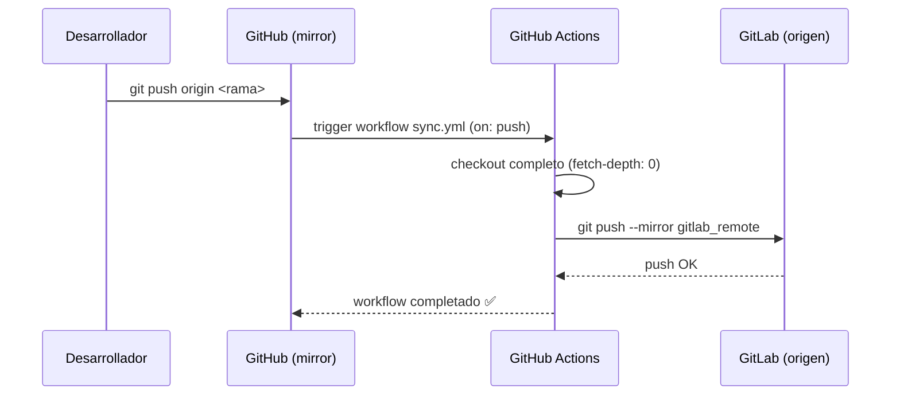

# Flujo: Sincronización GitHub → GitLab

> Describe cómo el repositorio espejo en GitHub se mantiene sincronizado con GitLab como fuente de verdad.

## Diagrama de flujo



## Archivo de configuración

**`.github/workflows/sync.yml`**

```yaml
on:
  push:
    branches:
      - '*'           # todas las ramas
      - '*/*'         # ramas con /
      - '**'          # subdirectorios

jobs:
  sync:
    runs-on: ubuntu-latest
    steps:
      - uses: actions/checkout@v2     # ⚠ DT-08: versión flotante, no SHA
        with:
          fetch-depth: 0

      - uses: wangchucheng/git-repo-sync@v0.1.0   # ⚠ DT-08: ídem
        with:
          target-url: ${{ secrets.GITLAB_URL }}
          target-username: ${{ secrets.GITLAB_USERNAME }}
          target-token: ${{ secrets.GITLAB_TOKEN }}
```

## Variables de GitHub Secrets requeridas

| Secret | Descripción |
|--------|-------------|
| `GITLAB_URL` | URL del repositorio GitLab destino |
| `GITLAB_USERNAME` | Usuario con permisos de push en GitLab |
| `GITLAB_TOKEN` | Token de acceso personal o deploy token de GitLab |

## Consideraciones de seguridad

> [!warning]
> El token `GITLAB_TOKEN` con permisos de escritura en el repositorio es un vector de ataque si se filtra.
> - Usar **deploy keys** de GitLab en lugar de tokens personales cuando sea posible.
> - Rotar el token periódicamente.
> - Restringir el token al scope mínimo necesario (`write_repository`).

## Casos límite

| Escenario | Comportamiento |
|-----------|---------------|
| Push de rama que no existe en GitLab | La rama se crea automáticamente (`--mirror`) |
| Eliminación de rama en GitHub | La rama se elimina en GitLab también (`--mirror`) |
| Conflicto de historial | El mirror fuerza la sobreescritura — GitLab pierde su historial local |
| GitHub Actions caído | La sincronización no ocurre; GitLab quedará desactualizado hasta el próximo push |

> [!caution]
> El flag `--mirror` es **destructivo** en GitLab. Si se hace un commit directamente en GitLab y luego se hace un push desde GitHub, el commit de GitLab se pierde. La fuente de verdad debe ser **siempre GitHub** o **siempre GitLab**, nunca ambos.

## Flujo inverso (no implementado)

Actualmente el flujo es **unidireccional**: GitHub → GitLab. Si se requiriera sincronización bidireccional, habría que implementar un webhook GitLab → GitHub adicional y gestionar conflictos de merge explícitamente.

## Referencias

- [[modulo-github-sync]]
- [[_indice-flujos]]
