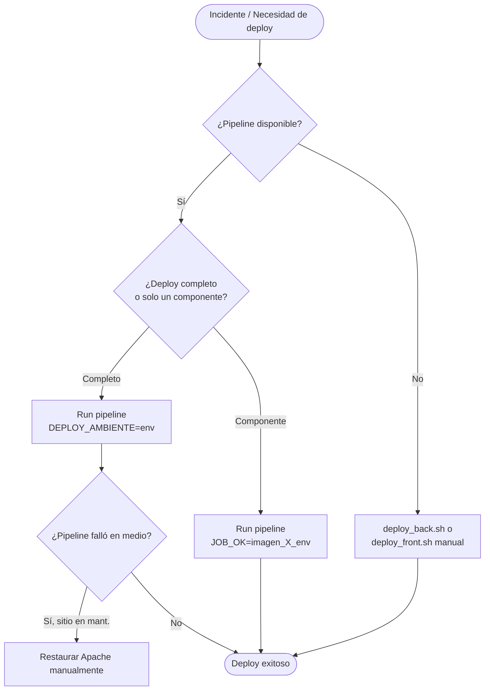

# Build y Despliegue — Config-Deploys Muvin

> Este repositorio **no tiene proceso de build propio**. Es el orquestador de los deploys de otros proyectos. Los únicos artefactos son los archivos de configuración versionados.

## Cómo iniciar un despliegue desde GitLab

### Opción 1 — Deploy completo de un ambiente

1. Ir a **GitLab → CI/CD → Pipelines → Run pipeline**
2. Branch: `main`
3. Agregar variable: `DEPLOY_AMBIENTE` = `dev` (o `cap`, `uat`, `prd`)
4. Click "Run pipeline"

### Opción 2 — Re-desplegar solo un componente

1. Ir a **GitLab → CI/CD → Pipelines → Run pipeline**
2. Branch: `main`
3. Agregar variable: `JOB_OK` = uno de:
   - `imagen_api_dev` / `imagen_api_cap` / `imagen_api_uat` / `imagen_api_prd`
   - `imagen_panel_dev` / `imagen_panel_cap` / `imagen_panel_prd`
   - `imagen_socket_dev` / `imagen_socket_cap` / `imagen_socket_prd`
4. Click "Run pipeline"

### Opción 3 — Deploy manual de emergencia (sin pipeline)

**Backend:**
```bash
ssh $USER@$SERVER_IP
./deploy_back.sh -b cap        # o "Produccion" para prod
```

**Frontend:**
```bash
ssh $USER@$SERVER_IP
./deploy_front.sh -b cap       # o "Produccion" para prod
```

## Cómo restaurar el sitio si queda en mantenimiento

Si el pipeline falla entre `pre_deploy` y `post_deploy`:

```bash
ssh $USER@$SERVER_IP
sudo a2ensite panel.muvinapp.com
sudo a2dissite mantenimiento
sudo systemctl reload apache2
docker rm -f MantenimientoMuvin
```

## Cómo restaurar desde backup

Si el deploy genera una regresión en la base de datos:

```bash
ssh $USER@$SERVER_IP
# El backup está en: /opt/backups/data/muinapp_PRE_DEPLOY.gz
zcat /opt/backups/data/muinapp_PRE_DEPLOY.gz | mysql \
  --user=$DB_USER --password=$DB_PASS \
  --host=$DB_IP dev_muvin_app
```

## Rollback de versión de aplicación

Disparar pipeline con `JOB_OK=imagen_api_dev` (o el ambiente correspondiente) apuntando a la imagen anterior en el registry, o hacer git revert del commit en el proyecto `muvinapp-new-api` / `muvinapp-new-panel`.

## Diagrama de decisión operativa


