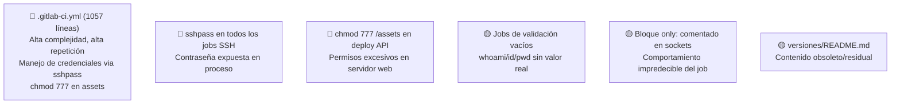

# Hotspots — Config-Deploys Muvin

## Mapa de hotspots

## Tabla de hotspots

| Archivo/Componente | Riesgo principal | Severidad | Acción recomendada |
|-------------------|-----------------|-----------|-------------------|
| `.gitlab-ci.yml` completo | 1057 líneas con alta repetición, `sshpass`, `chmod 777` | 🔴 | Refactorizar con `extends`; reemplazar `sshpass`; corregir permisos |
| `sshpass` en todos los jobs | Contraseña SSH en variable de proceso | 🔴 | Migrar a autenticación por clave SSH |
| `chmod 777 .../backend/assets` | Permisos excesivos en directorio web público | 🔴 | Usar `chmod 775` o `chmod 755` |
| `--password=` en mysqldump | Contraseña DB visible en `ps aux` | 🔴 | Usar `~/.my.cnf` o `--defaults-extra-file` |
| `5-validate_deploy_api` (whoami) | Sin validación real del deploy | 🟡 | Agregar HTTP smoke test al endpoint |
| `1-deploy_socket_*` con `only:` comentado | Job puede ejecutarse en condiciones inesperadas | 🟡 | Restaurar bloque `only:` o usar `rules:` correctamente |
| `versiones/README.md` | Archivo sin contenido útil | 🟢 | Eliminar o documentar correctamente |
| `DEPLOY_TOKEN` + project ID `200` hardcodeado | Acoplamiento a un ID específico de GitLab | 🟡 | Externalizar como variable CI |
