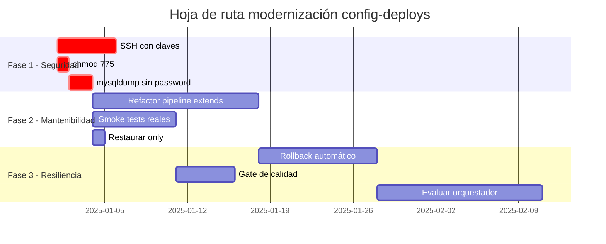

# Recomendaciones de Modernización — Config-Deploys Muvin

> Hoja de ruta para evolucionar el sistema de despliegues desde el estado actual hacia una infraestructura más segura, mantenible y resiliente.

## Estado actual vs. objetivo

| Dimensión | Estado actual | Objetivo |
|-----------|--------------|----------|
| Autenticación SSH | `sshpass` + contraseña en variable | Clave SSH con `SSH_PRIVATE_KEY` |
| Permisos filesystem | `chmod 777` en assets | `chmod 775` + `chown www-data` |
| Contraseñas en procesos | `mysqldump --password=` visible en `ps aux` | `--defaults-extra-file` |
| Rollback | Manual / no existe | Automático con snapshot o blue-green |
| Validación post-deploy | `whoami` (no válida nada) | Smoke test HTTP con `curl` |
| Mantenibilidad pipeline | 1057 líneas con ~80% repetición | Pipeline con `extends` o templates |
| Sincronización repos | GitHub Actions con versiones flotantes | Acciones ancladas con SHA |

---

## Fase 1 — Seguridad urgente (1-2 semanas)

> **Objetivo:** Eliminar los tres vectores de ataque críticos sin romper el pipeline.

### 1.1 Migrar a autenticación SSH con claves

1. Generar par de claves en la máquina de CI:
   ```bash
   ssh-keygen -t ed25519 -C "gitlab-ci@muvinapp" -f ~/.ssh/gitlab_ci_deploy
   ```
2. Copiar la clave pública a cada servidor (dev, cap, uat, prd):
   ```bash
   ssh-copy-id -i ~/.ssh/gitlab_ci_deploy.pub $USER@$SERVER
   ```
3. Agregar en GitLab → Settings → CI/CD → Variables:
   - `SSH_PRIVATE_KEY` (tipo **File**, protected)
   - `SSH_KNOWN_HOSTS` (output de `ssh-keyscan $SERVER`)
4. Eliminar variables `*_PASS` relacionadas con SSH.
5. Reemplazar `sshpass -p $PASS ssh $USER@$IP` por `ssh $USER@$IP`.

### 1.2 Corregir permisos de assets

En el job `4-deploy_api_*` reemplazar:
```yaml
# ANTES
- sshpass -p $PASS ssh $USER@$IP "sudo chmod 777 /var/www/html/api/backend/assets"
# DESPUÉS
- ssh $USER@$IP "sudo chmod 775 /var/www/html/api/backend/assets && sudo chown -R www-data:www-data /var/www/html/api/backend/assets"
```

### 1.3 Proteger contraseña de mysqldump

Crear en cada servidor un archivo `~/.my.cnf` con permisos `600` y eliminar `--password=` de los comandos del pipeline.

---

## Fase 2 — Mantenibilidad (2-4 semanas)

> **Objetivo:** Reducir el tamaño del pipeline y mejorar la confiabilidad de las validaciones.

### 2.1 Refactorizar .gitlab-ci.yml con `extends`

Los 4 ambientes repiten exactamente la misma lógica. Usar templates ocultos:

```yaml
# Template base para deploy API
.deploy_api_template:
  stage: deploy_api
  image: alpine:latest
  before_script:
    - apk add --no-cache openssh rsync
    - eval $(ssh-agent -s)
    - echo "$SSH_PRIVATE_KEY" | ssh-add -
  script:
    - rsync -avz --delete /sync/ $TARGET_USER@$TARGET_IP:$TARGET_PATH
    - ssh $TARGET_USER@$TARGET_IP "sudo chmod 775 $TARGET_PATH/api/backend/assets"

# Job concreto para dev
4-deploy_api_dev:
  extends: .deploy_api_template
  variables:
    TARGET_USER: $DEV_USER
    TARGET_IP: $DEV_IP
    TARGET_PATH: /var/www/html/api
  only:
    - dev
```

Resultado esperado: reducción de ~700 a ~300 líneas.

### 2.2 Reemplazar validaciones vacías

```yaml
# ANTES
5-validate_deploy_api_dev:
  script:
    - sshpass -p $DEV_PASS ssh $DEV_USER@$DEV_IP "whoami"

# DESPUÉS
5-validate_deploy_api_dev:
  script:
    - curl -sf --retry 3 --max-time 10 https://$DEV_DOMAIN/api/health || exit 1
```
Requiere agregar un endpoint `/api/health` en el backend Yii2.

### 2.3 Restaurar y revisar bloque `only:` en sockets

Activar el filtrado por rama correcto en los jobs de sockets para evitar deploys no intencionados:
```yaml
only:
  - dev  # o la rama correspondiente al ambiente
```

---

## Fase 3 — Resiliencia (1-2 meses)

> **Objetivo:** Capacidad de recuperarse ante fallos de deploy sin intervención manual.

### 3.1 Agregar rollback automático

Estrategia simple con backup de archivos:
```bash
# Antes de rsync, hacer snapshot:
ssh $USER@$IP "cp -r /var/www/html/api /var/www/html/api.bak.$(date +%Y%m%d%H%M%S)"
# Si el smoke test falla, restaurar:
ssh $USER@$IP "rm -rf /var/www/html/api && mv /var/www/html/api.bak.* /var/www/html/api"
```

Estrategia avanzada (blue-green): mantener dos directorios (`blue`/`green`) y cambiar el symlink activo solo si el smoke test pasa.

### 3.2 Introducir gate de calidad en promoción de ambientes

Antes del trigger `DEV→CAP` agregar un job de aprobación manual o una etapa de integration tests:
```yaml
approve_promotion_to_cap:
  stage: approve
  when: manual
  only:
    - dev
  script:
    - echo "Promoción aprobada manualmente"
```

### 3.3 Evaluar migración a orquestador de contenedores

Si el número de servicios crece, considerar:
- **Docker Swarm** — mínimo cambio, compatibilidad con `docker-compose.yml` existente.
- **Kubernetes (k3s)** — mayor curva de aprendizaje pero escalabilidad real y rolling updates nativos.

Para el volumen actual (4 ambientes, 4 servicios) Docker Swarm es suficiente y reduce la complejidad de operar Kubernetes.

---

## Mapa de evolución



---

## Referencias

- [[hotspots]] — Mapa de componentes críticos
- [[deuda-tecnica]] — Lista completa de ítems DT-01 a DT-14
- [[modulo-gitlab-ci]] — Descripción del pipeline actual
- [[seguridad-inventory]] — Inventario de hallazgos SEC-001 a SEC-007
