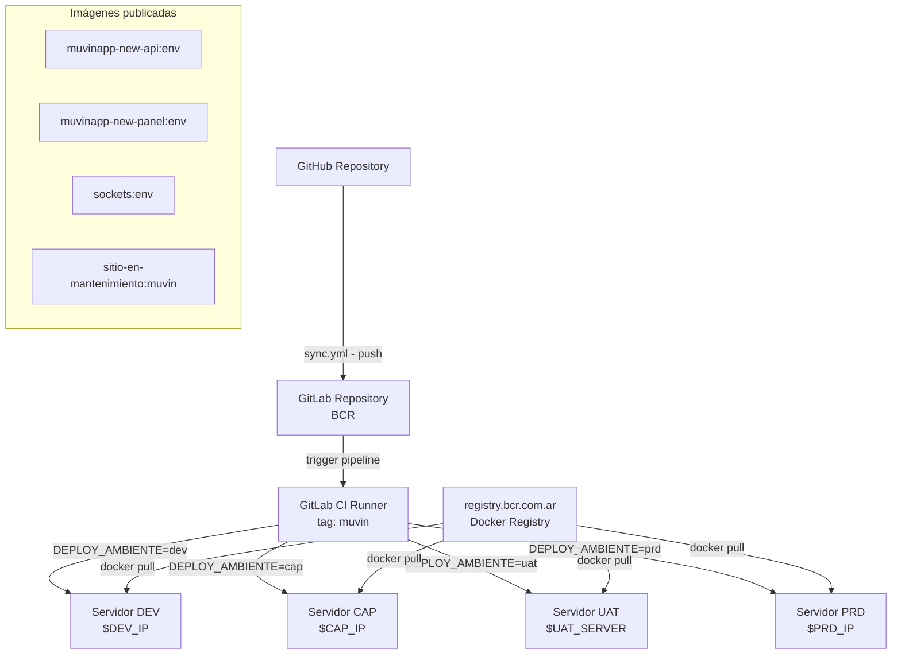
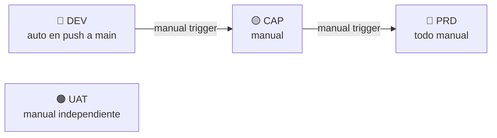

# Config-Deploys — Muvin

> **Stack:** GitLab CI/CD · GitHub Actions · Docker · Bash · Apache2 · sshpass
> **Tipo:** Pipeline de despliegue automatizado / scripts de operaciones
> **Ambientes:** dev · cap · uat · prd
> **Registry:** `registry.bcr.com.ar`
> **Última revisión:** 2026-05-05
> **Repositorio origen:** `config-deploys-main/config-deploys`

---

> [!info] Propósito
> Este repositorio centraliza toda la configuración de CI/CD y scripts de despliegue del ecosistema **Muvin**. Controla los despliegues automatizados de la API backend (`muvinapp-new-api`), el frontend panel (`muvinapp-new-panel`) y el servicio de sockets a los ambientes de Desarrollo, Capacitación, UAT y Producción de BCR.

---

## 📦 Módulos / Componentes principales

| # | Módulo | Descripción breve | Criticidad | Enlace |
|---|--------|-------------------|------------|--------|
| 1 | Pipeline GitLab CI/CD | Orquesta todo el ciclo de despliegue por ambiente | 🔴 Alta | [[modulo-gitlab-ci]] |
| 2 | Deploy API | Extrae imagen Docker y despliega backend Yii2 | 🔴 Alta | [[modulo-deploy-api]] |
| 3 | Deploy Frontend | Extrae imagen Docker y despliega panel Vue/React | 🟡 Media | [[modulo-deploy-fe]] |
| 4 | Deploy Sockets | Levanta servicio de sockets + Redis con Docker Compose | 🟡 Media | [[modulo-deploy-sockets]] |
| 5 | Modo Mantenimiento | Activa/desactiva sitio de mantenimiento via Apache | 🟡 Media | [[modulo-mantenimiento]] |
| 6 | Scripts manuales | `deploy_back.sh` y `deploy_front.sh` para deploy manual | 🟢 Baja | [[modulo-scripts-manuales]] |
| 7 | Sync GitHub→GitLab | Sincroniza ramas entre repositorios | 🟢 Baja | [[modulo-github-sync]] |

---

## 🔗 Enlaces rápidos a inventarios

- [[tree-estructura-archivos]] — Árbol de archivos
- [[cross-module-dependencies]] — Dependencias entre módulos
- [[depends-matrix]] — Matriz NxN de dependencias
- [[functional-classification]] — Clasificación funcional
- [[core-vs-custom-dependencies]] — Core vs customizaciones
- [[security-inventory]] — Inventario de seguridad 🔒
- [[data-files-index]] — Archivos de datos y configuración

---

## 🗺️ Arquitectura de alto nivel

---

## 🧭 Flujo de promoción entre ambientes

---

## ⚙️ Variables GitLab requeridas

Ver [[requisitos-entorno]] para el listado completo de variables CI/CD a configurar.

---

## 🧭 Convenciones

| Ícono | Significado |
|-------|-------------|
| 🟢 | Sano / Bajo riesgo |
| 🟡 | Atención / Riesgo medio |
| 🔴 | Crítico / Alto riesgo |
| ⚠️ | Advertencia puntual |
| 🔒 | Afecta seguridad |
| 🔄 | Proceso automático |
| 🧙 | Manual / requiere intervención |
