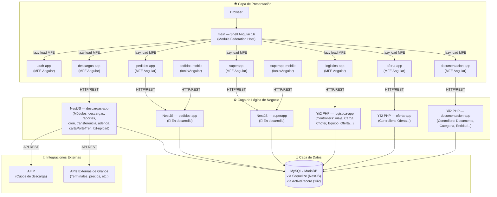

# Arquitectura de Alto Nivel

> **Última revisión:** 2026-04-29

## Descripción General

La plataforma utiliza una arquitectura de **microfrontends con Module Federation** sobre Angular 16. El `main` actúa como host (shell) que carga bajo demanda los microfrontends remotos. Los backends son independientes por dominio: los módulos nuevos usan NestJS 10, los módulos legacy usan Yii2 PHP.

## Diagrama de Arquitectura

## Descripción de Capas

### 🌐 Presentación
- **Shell (`main`):** aplicación Angular 16 que actúa como host de Module Federation. Gestiona la navegación principal, el layout (Vex theme), la autenticación global y el lazy loading de los MFEs remotos.
- **MFEs remotos:** cada `*-app/frontend` es un microfrontend Angular independiente, compilable y ejecutable de forma autónoma. Se exponen como `remote` de Webpack Module Federation.
- **Mobile:** las apps de `pedidos` y `superapp` tienen versiones móviles con Ionic/Angular.

### ⚙️ Lógica de Negocio
- **NestJS (nuevos):** backends en TypeScript con arquitectura modular (módulos, controladores, servicios). Usan Sequelize ORM para la base de datos y tienen middleware de autenticación por token JWT.
- **Yii2 PHP (legacy):** backends PHP con patrón MVC activo. Gestión de autenticación propia, ActiveRecord para DB, Swagger integrado parcialmente.

### 🗄️ Datos
- Base de datos relacional (MySQL/MariaDB inferido por Sequelize + Yii2 ActiveRecord).
- El acceso desde NestJS es vía `@nestjs/sequelize`. Desde Yii2 es vía ActiveRecord.

### 🔌 Integraciones Externas
- **AFIP:** actualización de cupos de descarga en `descargas-app/backend`.
- **APIs externas:** servicio `external.api.service.ts` en descargas-app para consulta de datos de terminales y granos.
