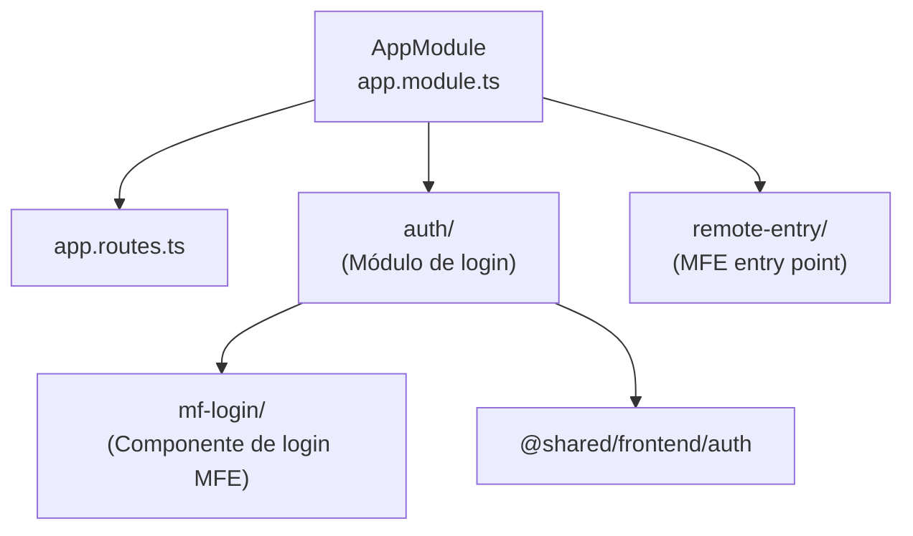

# Módulo: Auth App

> **Ruta/Namespace:** `auth-app/`
> **Responsable histórico:** ⚠️ Pendiente de verificar
> **Criticidad:** 🔴 Alta
> **Estado:** Activo

## Propósito

Gestiona la autenticación de usuarios en la plataforma. Expone un microfrontend de login que se carga en el shell principal, y provee las funcionalidades de ingreso de credenciales, validación de sesión y redirección post-login. El backend de este módulo es un stub mínimo (solo tiene un `README.md`), lo que sugiere que la autenticación real puede estar delegada a un servicio externo o al propio Yii2 de otros backends.

## Funcionalidades que expone

| # | Funcionalidad | Descripción breve | Detalle |
|---|---|---|---|
| 1.1 | Login UI | Pantalla de ingreso de credenciales | [[auth-login]] |
| 1.2 | Remote Entry | Punto de entrada MFE para ser cargado por el shell | 🚧 Pendiente de verificar |
| 1.3 | Auth guard | Guard compartido en `shared/frontend/auth` | [[modulo-shared]] |

## Dependencias

- **Depende de:** [[modulo-shared]] (shared/frontend/auth)
- **Es usado por:** [[modulo-main-shell]]
- **Consume servicios backend:** ⚠️ Pendiente de verificar — el backend stub `auth-app/backend/api/README.md` no tiene código

## Diagrama de componentes internos

## Servicios Backend Consumidos

| Verbo | Ruta | Propósito | Detalle |
|---|---|---|---|
| ⚠️ Pendiente | ⚠️ Pendiente | Login / validación de token | ⚠️ Pendiente de verificar en código fuente |

## Entidades de datos implicadas

⚠️ Pendiente de verificar — posiblemente [[entidad-usuario]].

## Riesgos y deuda técnica detectados

- 🔴 El backend de auth-app es un stub vacío (`auth-app/backend/api/README.md`). No hay implementación documentada de la autenticación backend.
- ⚠️ No está claro si la validación de JWT ocurre en un servicio externo, en el backend de otro módulo, o si está pendiente de implementar.
- ⚠️ La carpeta `mf-login/` dentro del frontend sugiere un componente específico para el modo MFE que puede tener lógica diferente al login standalone.

## Archivos fuente relevantes

- `auth-app/frontend/src/app/app.module.ts`
- `auth-app/frontend/src/app/app.routes.ts`
- `auth-app/frontend/src/app/auth/`
- `auth-app/frontend/src/app/remote-entry/`
- `auth-app/frontend/src/mf-login/`
- `auth-app/backend/api/README.md`
- `auth-app/frontend/module-federation.config.js`
