# Módulo: Descargas App

> **Ruta/Namespace:** `descargas-app/`
> **Responsable histórico:** ⚠️ Pendiente de verificar
> **Criticidad:** 🔴 Alta
> **Estado:** Activo

## Propósito

Es el módulo central del negocio. Gestiona el ciclo completo de descargas de granos: cupos (incluyendo actualización contra AFIP), carta porte (camión y tren), adendas, transferencias entre terminales, reportes Excel y cargas de archivos TXT. Tiene el backend NestJS más completo y estructurado del monorepo.

## Funcionalidades que expone

| # | Funcionalidad | Descripción breve | Detalle |
|---|---|---|---|
| 1.1 | Gestión de Cupos | CRUD de cupos de descarga con sincronización AFIP | [[descargas-gestion-cupos]] |
| 1.2 | Carta Porte Camión | Generación y gestión de carta porte para camiones | [[descargas-carta-porte]] |
| 1.3 | Carta Porte Tren | Generación y gestión de carta porte para trenes | [[descargas-carta-porte-tren]] |
| 1.4 | Adendas | Gestión de adendas a descargas | [[descargas-adendas]] |
| 1.5 | Transferencias | Transferencia de cupos entre terminales | [[descargas-transferencia]] |
| 1.6 | Reportes | Exportación de reportes en Excel | [[descargas-reportes]] |
| 1.7 | Carga TXT | Importación de datos desde archivos TXT | [[descargas-txt-upload]] |
| 1.8 | Centro de Descargas | Vista centralizada de operaciones | [[descargas-centro]] |
| 1.9 | Cron Jobs | Tareas automáticas programadas | [[descargas-cron]] |

## Dependencias

- **Depende de:** [[modulo-shared]] (auth, ux-components), [[modulo-main-shell]]
- **Es usado por:** [[modulo-main-shell]] (como MFE remoto)
- **Consume servicios backend:** `descargas-app/backend` (NestJS) + AFIP (externo) + APIs externas

## Diagrama de componentes internos

```mermaid
graph TD
    subgraph Frontend["Frontend Angular MFE"]
        AppModule["AppModule"]
        Routes["app.routes.ts"]
        PageDescargas["page/descargas/\nDescargasComponent"]
        PageAdenda["page/adenda/"]
        PageCarta["page/carta-porte/"]
        PageCartaTren["page/carta-porte-tren/"]
        PageCentro["page/centro-descargas/"]
        PageTransferencia["page/transferencia/"]
        RemoteEntry["remote-entry/"]
        Domain["domain/ (lógica de negocio)"]
        Components["components/ (UI)"]
        DataServices["data/ (servicios HTTP)"]
    end

    subgraph Backend["Backend NestJS"]
        AppModule_BE["AppModule"]
        TokenMW["TokenMiddleware\n(JWT auth)"]
        LogInterceptor["LoggingInterceptor"]

        DescMod["DescargasModule"]
        RptMod["ReportesModule"]
        CronMod["CronModule"]
        TxtMod["TxtUploadModule"]
        TransMod["TransferenciaModule"]
        AdendaMod["AdendaModule"]
        CPTrenMod["CartaPorteTrenModule"]

        DescCtrl["DescargasController\n/descargas"]
        RptCtrl["ReportesController\n/reportes"]
        CronCtrl["CronController\n/cron"]
        TxtCtrl["TxtUploadController\n/txt-upload"]
        TransCtrl["TransferenciaController\n/transferencia"]
        AdendaCtrl["AdendaController\n/adenda"]
        TrenCtrl["TrenController\n/tren"]
        RolesCtrl["ConsultarRolesController"]
    end

    Routes --> PageDescargas
    Routes --> PageAdenda
    Routes --> PageCarta
    Routes --> PageCartaTren
    Routes --> PageCentro
    Routes --> PageTransferencia
    PageDescargas --> DataServices
    DataServices -->|HTTP| DescCtrl
    DataServices -->|HTTP| RptCtrl

    AppModule_BE --> TokenMW
    AppModule_BE --> LogInterceptor
    AppModule_BE --> DescMod
    AppModule_BE --> RptMod
    AppModule_BE --> CronMod
    AppModule_BE --> TxtMod
    AppModule_BE --> TransMod
    AppModule_BE --> AdendaMod
    AppModule_BE --> CPTrenMod

    DescMod --> DescCtrl
    RptMod --> RptCtrl
    CronMod --> CronCtrl
    TxtMod --> TxtCtrl
    TransMod --> TransCtrl
    AdendaMod --> AdendaCtrl
    CPTrenMod --> TrenCtrl
```

## Servicios Backend Consumidos

| Verbo | Ruta | Propósito | Detalle |
|---|---|---|---|
| POST | `/descargas/actualizar-cupo-afip` | Actualizar cupos contra AFIP | [[descargas-endpoints#POST-actualizar-cupo-afip]] |
| POST | `/descargas` | Crear/actualizar cupos de descarga | [[descargas-endpoints#POST-descargas]] |
| PUT | `/descargas` | Actualizar estado de cupo | [[descargas-endpoints#PUT-descargas]] |
| GET | `/descargas` | Consultar cupos | [[descargas-endpoints#GET-descargas]] |
| POST | `/reportes` | Generar reporte Excel | [[descargas-endpoints#POST-reportes]] |
| POST | `/transferencia` | Crear transferencia | [[descargas-endpoints#POST-transferencia]] |
| POST | `/adenda` | Crear adenda | [[descargas-endpoints#POST-adenda]] |
| POST | `/tren` | Gestión carta porte tren | [[descargas-endpoints#POST-tren]] |
| POST | `/txt-upload` | Carga masiva desde TXT | [[descargas-endpoints#POST-txt-upload]] |

## Entidades de datos implicadas

[[entidad-cupo]], [[entidad-adenda]], [[entidad-carta-porte-tren]], [[entidad-transferencia]], [[entidad-motivo-error]], [[entidad-valores-calidad]]

## Riesgos y deuda técnica detectados

- ⚠️ `NoHtmlPipe` declarada dentro del controlador `descargas.controller.ts` en lugar de un archivo de pipes dedicado.
- ⚠️ `console.error` en múltiples catch blocks del controlador — los errores no se registran en el sistema de logs estructurado.
- 🔴 Dependencia crítica con AFIP: si la API de AFIP no responde, el flujo de actualización de cupos falla con mensaje genérico al usuario.
- ⚠️ Cron jobs activos: es necesario documentar qué tareas corren, con qué frecuencia y qué impacto tienen.
- ⚠️ `exiftool-vendored` es una dependencia nativa que puede dar problemas en ambientes Docker si no se incluye el binario.

## Archivos fuente relevantes

- `descargas-app/backend/src/app.module.ts`
- `descargas-app/backend/src/controllers/descargas.controller.ts`
- `descargas-app/backend/src/controllers/reportes.controller.ts`
- `descargas-app/backend/src/controllers/adenda.controller.ts`
- `descargas-app/backend/src/controllers/tren.controller.ts`
- `descargas-app/backend/src/controllers/transferencia.controller.ts`
- `descargas-app/backend/src/controllers/cron.controller.ts`
- `descargas-app/backend/src/controllers/txt-upload.controller.ts`
- `descargas-app/backend/src/services/descargas.service.ts`
- `descargas-app/backend/src/services/external.api.service.ts`
- `descargas-app/backend/src/services/cron.service.ts`
- `descargas-app/backend/src/models/cupo.model.ts`
- `descargas-app/frontend/src/app/page/descargas/`
- `descargas-app/frontend/src/app/page/adenda/`
- `descargas-app/frontend/src/app/page/carta-porte/`
- `descargas-app/frontend/src/app/page/carta-porte-tren/`
- `descargas-app/frontend/src/app/page/centro-descargas/`
- `descargas-app/frontend/src/app/page/transferencia/`
