# Módulo: Documentación App

> **Ruta/Namespace:** `documentacion-app/`
> **Responsable histórico:** ⚠️ Pendiente de verificar
> **Criticidad:** 🟡 Media
> **Estado:** Activo

## Propósito

Gestiona la documentación empresarial de las entidades (empresas, proveedores, etc.) que operan en la plataforma. Permite cargar, categorizar, revisar y hacer seguimiento de documentos con fecha de vencimiento. El backend es Yii2 PHP con 14 controladores. El frontend es un microfrontend Angular 16 con módulos de `categoria` y `centro-documentacion`.

## Funcionalidades que expone

| # | Funcionalidad | Descripción breve | Detalle |
|---|---|---|---|
| 1.1 | Centro de Documentación | Vista y gestión centralizada de documentos por entidad | [[documentacion-centro]] |
| 1.2 | Gestión de Categorías | ABM de categorías de documentos | [[documentacion-categorias]] |
| 1.3 | Gestión de Documentos | Carga, revisión y aprobación/rechazo de documentos | [[documentacion-documentos]] |
| 1.4 | Vencimientos | Control y alertas de documentos próximos a vencer | [[documentacion-vencimientos]] |
| 1.5 | Entidades | Gestión de entidades que presentan documentación | [[documentacion-entidades]] |
| 1.6 | Recursos Externos | Consulta de recursos externos asociados a documentos | 🚧 Pendiente de verificar |

## Dependencias

- **Depende de:** [[modulo-shared]], [[modulo-main-shell]]
- **Es usado por:** [[modulo-main-shell]] (como MFE remoto)
- **Consume servicios backend:** `documentacion-app/backend/api/source` (Yii2 PHP)

## Diagrama de componentes internos

```mermaid
graph TD
    subgraph Frontend["Frontend Angular MFE"]
        AppModule["AppModule"]
        Routes["app.routes.ts"]
        ModCategoria["modules/categoria/"]
        ModCentro["modules/centro-documentacion/"]
        Components["components/"]
        Shared["shared/"]
        Guards["guards/"]
        RemoteEntry["remote-entry/"]
    end

    subgraph Backend["Backend Yii2 PHP"]
        CategoriaCtrl["CategoriaController"]
        CategoriaTipoCtrl["CategoriaTipoDocController"]
        DocumentoCtrl["DocumentoController"]
        DocumentoTipoCtrl["DocumentoTipoController"]
        EmpresaAsocCtrl["EmpresaAsocController"]
        EntidadCtrl["EntidadController"]
        EntidadTipoDocCtrl["EntidadTipoDocumentoController"]
        InfoUserCtrl["InfoUserController"]
        MotivoRechazoCtrl["MotivoRechazoController"]
        PresentacionEstCtrl["PresentacionEstadoController"]
        RecExtCtrl["RecursosExternosController"]
        SiteCtrl["SiteController"]
        UsuarioEntidadCtrl["UsuarioEntidadHijaController"]
        VencCtrl["VencimientosController"]
    end

    Routes --> ModCategoria
    Routes --> ModCentro
    ModCentro --> Components
    ModCentro -->|HTTP REST| DocumentoCtrl
    ModCentro -->|HTTP REST| VencCtrl
    ModCentro -->|HTTP REST| EntidadCtrl
    ModCategoria -->|HTTP REST| CategoriaCtrl
```

## Servicios Backend Consumidos

| Verbo | Ruta | Propósito | Detalle |
|---|---|---|---|
| GET/POST/PUT/DELETE | `/documento` | CRUD de documentos | [[documentacion-endpoints#documento]] |
| GET/POST/PUT/DELETE | `/categoria` | CRUD de categorías | [[documentacion-endpoints#categoria]] |
| GET/POST/PUT/DELETE | `/entidad` | CRUD de entidades | [[documentacion-endpoints#entidad]] |
| GET | `/vencimientos` | Consulta de vencimientos | [[documentacion-endpoints#vencimientos]] |
| GET/POST | `/presentacion-estado` | Estado de presentaciones | [[documentacion-endpoints#presentacion]] |
| GET | `/motivo-rechazo` | Motivos de rechazo de documentos | [[documentacion-endpoints#motivo-rechazo]] |

## Entidades de datos implicadas

[[entidad-documento]], [[entidad-categoria]], [[entidad-entidad]], [[entidad-presentacion]]

## Riesgos y deuda técnica detectados

- 🔴 Backend en Yii2 PHP (legacy). 14 controladores activos sin plan de migración.
- ⚠️ `UsuarioEntidadHijaController.php` sugiere una estructura de entidades con herencia (entidad madre / entidad hija) que puede ser compleja de entender sin documentación adicional.
- ⚠️ `RecursosExternosController.php` — propósito no completamente claro desde el nombre; requiere revisión del código fuente.
- ⚠️ El manejo de archivos adjuntos (documentos) puede implicar almacenamiento en disco del servidor Yii2, lo que es un riesgo en ambientes containerizados.

## Archivos fuente relevantes

- `documentacion-app/backend/api/source/controllers/DocumentoController.php`
- `documentacion-app/backend/api/source/controllers/CategoriaController.php`
- `documentacion-app/backend/api/source/controllers/EntidadController.php`
- `documentacion-app/backend/api/source/controllers/VencimientosController.php`
- `documentacion-app/backend/api/source/controllers/PresentacionEstadoController.php`
- `documentacion-app/backend/api/source/models/`
- `documentacion-app/frontend/src/app/modules/categoria/`
- `documentacion-app/frontend/src/app/modules/centro-documentacion/`
- `documentacion-app/backend/api/source/console/` (posibles comandos de consola)
