# Módulo: Logística App

> **Ruta/Namespace:** `logistica-app/`
> **Responsable histórico:** ⚠️ Pendiente de verificar
> **Criticidad:** 🟡 Media
> **Estado:** Activo

## Propósito

Gestiona la logística de transporte de granos: viajes, cargas, choferes, equipos (camiones/vagones), destinos, orígenes, derivaciones y estados de viaje. El backend es Yii2 PHP (legacy) con 15 controladores activos. El frontend es un microfrontend Angular 16 que consume la API Yii2.

## Funcionalidades que expone

| # | Funcionalidad | Descripción breve | Detalle |
|---|---|---|---|
| 1.1 | Gestión de Viajes | CRUD de viajes logísticos | [[logistica-viajes]] |
| 1.2 | Gestión de Cargas | Cargas asociadas a viajes, con derivaciones | [[logistica-cargas]] |
| 1.3 | Gestión de Choferes | ABM de choferes | [[logistica-choferes]] |
| 1.4 | Gestión de Equipos | ABM de equipos de transporte | [[logistica-equipos]] |
| 1.5 | Derivaciones | Redireccionamiento de cargas | [[logistica-derivaciones]] |
| 1.6 | Orígenes y Destinos | ABM de orígenes y destinos de transporte | 🚧 Pendiente de documentar |
| 1.7 | Vista Proveedor | Sección de vista para proveedores logísticos | [[logistica-proveedor]] |
| 1.8 | Ofertas logísticas | Gestión de ofertas dentro del contexto logístico | 🚧 Pendiente de verificar si difiere de [[modulo-oferta]] |

## Dependencias

- **Depende de:** [[modulo-shared]], [[modulo-main-shell]]
- **Es usado por:** [[modulo-main-shell]] (como MFE remoto)
- **Consume servicios backend:** `logistica-app/backend/api/source` (Yii2 PHP)

## Diagrama de componentes internos

```mermaid
graph TD
    subgraph Frontend["Frontend Angular MFE"]
        AppModule["AppModule"]
        Routes["app-routing.module.ts"]
        PageProveedor["page/proveedor/"]
        Services["services/"]
        State["state/ (NGXS)"]
        Models["models/"]
        Guards["guards/"]
        UXComponents["ux-components/"]
        RemoteEntry["remote-entry/"]
        Load["load/ (lazy modules)"]
    end

    subgraph Backend["Backend Yii2 PHP"]
        ViajeCtrl["ViajeController"]
        CargaCtrl["CargaController"]
        CargaDerivadaCtrl["CargaDerivadaController"]
        CargaDetalleCtrl["CargaDetalleController"]
        ChoferCtrl["ChoferController"]
        DerivacionCtrl["DerivacionController"]
        DestinoCtrl["DestinoController"]
        EquipoCtrl["EquipoController"]
        EstadoViajeCtrl["EstadoViajeController"]
        IntermedCtrl["IntermediarioController"]
        MotivoCancelCtrl["MotivoCancelacionController"]
        OfertaCtrl["OfertaController"]
        OrigenCtrl["OrigenController"]
        ProductoCtrl["ProductoController"]
        SiteCtrl["SiteController"]
    end

    Routes --> PageProveedor
    Routes --> Load
    PageProveedor --> Services
    Services --> State
    Services -->|HTTP REST| ViajeCtrl
    Services -->|HTTP REST| CargaCtrl
    Services -->|HTTP REST| ChoferCtrl
    Services -->|HTTP REST| EquipoCtrl
```

## Servicios Backend Consumidos

| Verbo | Ruta | Propósito | Detalle |
|---|---|---|---|
| GET/POST/PUT/DELETE | `/viaje` | CRUD de viajes | [[logistica-endpoints#viaje]] |
| GET/POST/PUT/DELETE | `/carga` | CRUD de cargas | [[logistica-endpoints#carga]] |
| GET/POST/PUT/DELETE | `/chofer` | CRUD de choferes | [[logistica-endpoints#chofer]] |
| GET/POST/PUT/DELETE | `/equipo` | CRUD de equipos | [[logistica-endpoints#equipo]] |
| GET/POST/PUT/DELETE | `/derivacion` | CRUD de derivaciones | [[logistica-endpoints#derivacion]] |
| GET/POST | `/oferta` | Gestión de ofertas logísticas | [[logistica-endpoints#oferta]] |

## Entidades de datos implicadas

[[entidad-viaje]], [[entidad-carga]], [[entidad-chofer]], [[entidad-equipo]], [[entidad-derivacion]]

## Riesgos y deuda técnica detectados

- 🔴 Backend en Yii2 PHP (legacy). Sin hoja de ruta de migración a NestJS documentada.
- ⚠️ PHP version no verificada — si es < 8.1, está en EOL.
- ⚠️ La autenticación en Yii2 puede diferir del mecanismo JWT del resto de la plataforma.
- ⚠️ `OfertaController.php` en logistica puede solaparse en responsabilidad con `oferta-app`.

## Archivos fuente relevantes

- `logistica-app/backend/api/source/controllers/ViajeController.php`
- `logistica-app/backend/api/source/controllers/CargaController.php`
- `logistica-app/backend/api/source/controllers/ChoferController.php`
- `logistica-app/backend/api/source/controllers/EquipoController.php`
- `logistica-app/backend/api/source/controllers/DerivacionController.php`
- `logistica-app/backend/api/source/models/`
- `logistica-app/frontend/src/app/page/proveedor/`
- `logistica-app/frontend/src/app/services/`
- `logistica-app/frontend/src/app/state/`
