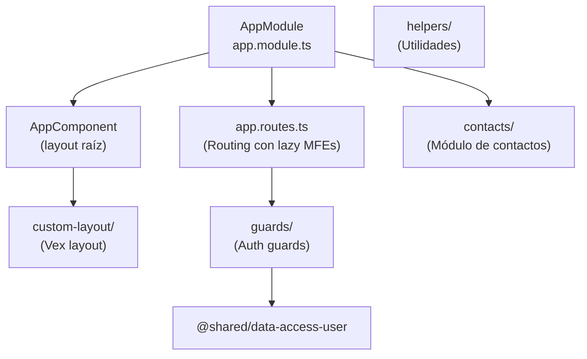

# Módulo: Main Shell

> **Ruta/Namespace:** `main/`
> **Responsable histórico:** ⚠️ Pendiente de verificar
> **Criticidad:** 🔴 Alta
> **Estado:** Activo

## Propósito

Es la aplicación Angular 16 que actúa como **host de Module Federation**. Carga bajo demanda todos los microfrontends remotos (`*-app/frontend`), gestiona el layout global (Vex theme), la navegación principal y el estado de sesión del usuario. Es el punto de entrada único para el usuario en la plataforma.

## Funcionalidades que expone

| # | Funcionalidad | Descripción breve | Detalle |
|---|---|---|---|
| 1.1 | Carga de MFEs | Lazy loading de microfrontends remotos vía Module Federation | [[main-shell-mfe-loading]] |
| 1.2 | Navegación global | Routing principal con guards de autenticación | [[main-shell-routing]] |
| 1.3 | Layout Vex | Sidebar, header, breadcrumbs y tema visual | 🚧 Sin funcionalidad dedicada |
| 1.4 | Contacts | Módulo de contactos embebido en el shell | 🚧 Pendiente de verificar |

## Dependencias

- **Depende de:** [[modulo-shared]] (shared/frontend/auth, shared/frontend/global-setting)
- **Es usado por:** Todos los MFEs lo referencian como host
- **Consume servicios backend:** Indirecto — los MFEs consumen sus propios backends

## Diagrama de componentes internos

## Servicios Backend Consumidos

> El shell no consume directamente servicios backend de negocio. La autenticación es delegada a [[modulo-auth]].

## Entidades de datos implicadas

⚠️ Pendiente de verificar — posiblemente consume [[entidad-usuario]] vía shared.

## Riesgos y deuda técnica detectados

- 🔴 Angular 16 está en EOL (Nov 2024). Riesgo de seguridad y falta de soporte.
- 🔴 Node.js 18 requerido, también en EOL (Apr 2025). Ver [[stack-tecnologico]].
- ⚠️ El Vex theme está embebido como carpeta `@vex/` dentro del código fuente, lo que dificulta actualizaciones del tema.
- ⚠️ `contacts/` en el shell: su propósito de negocio no está claro en el código analizado.

## Archivos fuente relevantes

- `main/src/app/app.module.ts`
- `main/src/app/app.routes.ts`
- `main/src/app/app.component.ts`
- `main/src/app/custom-layout/`
- `main/src/app/guards/`
- `main/module-federation.config.js`
- `main/webpack.config.js`
- `main/proxy.conf.json`
