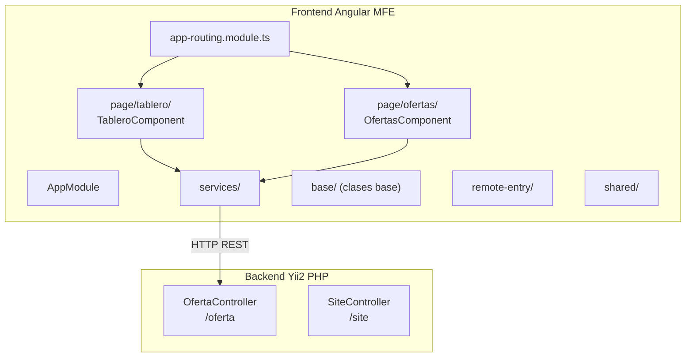

# Módulo: Oferta App

> **Ruta/Namespace:** `oferta-app/`
> **Responsable histórico:** ⚠️ Pendiente de verificar
> **Criticidad:** 🟡 Media
> **Estado:** Activo

## Propósito

Gestiona las ofertas comerciales de compra/venta de granos. Proporciona un tablero de visualización de ofertas activas y un módulo de gestión CRUD. El backend es Yii2 PHP. El frontend es un microfrontend Angular 16 con rutas `tablero` y `ofertas`.

## Funcionalidades que expone

| # | Funcionalidad | Descripción breve | Detalle |
|---|---|---|---|
| 1.1 | Tablero de Ofertas | Vista resumen de ofertas activas del mercado | [[oferta-tablero]] |
| 1.2 | Gestión de Ofertas | CRUD de ofertas comerciales | [[oferta-gestion]] |

## Dependencias

- **Depende de:** [[modulo-shared]], [[modulo-main-shell]]
- **Es usado por:** [[modulo-main-shell]] (como MFE remoto)
- **Consume servicios backend:** `oferta-app/backend/api/source` (Yii2 PHP)

## Diagrama de componentes internos

## Servicios Backend Consumidos

| Verbo | Ruta | Propósito | Detalle |
|---|---|---|---|
| GET | `/oferta` | Listar ofertas | [[oferta-endpoints#GET-oferta]] |
| POST | `/oferta` | Crear oferta | [[oferta-endpoints#POST-oferta]] |
| PUT | `/oferta/{id}` | Actualizar oferta | [[oferta-endpoints#PUT-oferta]] |
| DELETE | `/oferta/{id}` | Eliminar oferta | [[oferta-endpoints#DELETE-oferta]] |

## Entidades de datos implicadas

[[entidad-oferta]]

## Riesgos y deuda técnica detectados

- 🔴 Backend en Yii2 PHP (legacy). Sin plan de migración documentado.
- ⚠️ El módulo de ofertas también existe en `logistica-app/backend/api/source/controllers/OfertaController.php`. Puede haber duplicidad de lógica o responsabilidades no claramente separadas.
- ⚠️ La autenticación y autorización en Yii2 puede no estar alineada con el JWT del resto de la plataforma.

## Archivos fuente relevantes

- `oferta-app/backend/api/source/controllers/OfertaController.php`
- `oferta-app/backend/api/source/models/`
- `oferta-app/frontend/src/app/page/tablero/`
- `oferta-app/frontend/src/app/page/ofertas/`
- `oferta-app/frontend/src/app/services/`
- `oferta-app/frontend/module-federation.config.js`
