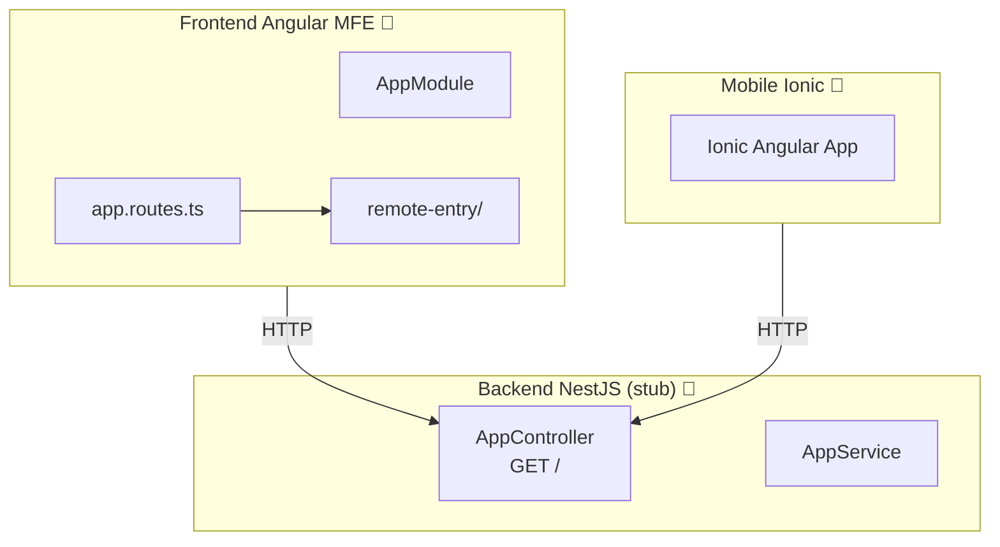

# Módulo: Pedidos App

> **Ruta/Namespace:** `pedidos-app/`
> **Responsable histórico:** ⚠️ Pendiente de verificar
> **Criticidad:** 🟡 Media
> **Estado:** En desarrollo (🚧)

## Propósito

Módulo en desarrollo para la gestión de pedidos. Incluye un microfrontend Angular 16, una app mobile Ionic y un backend NestJS. El backend actual es un stub mínimo (solo `AppController` y `AppService` con los templates de NestJS por defecto), lo que indica que está en etapa temprana de desarrollo.

## Funcionalidades que expone

| # | Funcionalidad | Descripción breve | Detalle |
|---|---|---|---|
| 1.1 | Gestión de Pedidos | CRUD de pedidos | 🚧 En desarrollo |
| 1.2 | Mobile Pedidos | App Ionic para pedidos desde dispositivos móviles | 🚧 En desarrollo |

## Dependencias

- **Depende de:** [[modulo-shared]], [[modulo-main-shell]]
- **Es usado por:** [[modulo-main-shell]] (como MFE remoto)
- **Consume servicios backend:** `pedidos-app/backend` (NestJS — en desarrollo)

## Diagrama de componentes internos

## Servicios Backend Consumidos

> ⚠️ El backend es un stub. Solo tiene el endpoint de health check `GET /` generado por defecto.

## Entidades de datos implicadas

⚠️ Pendiente — no hay modelos definidos en el backend actual.

## Riesgos y deuda técnica detectados

- 🔴 Backend en estado stub. No tiene lógica de negocio implementada.
- ⚠️ Existe el andamiaje (module-federation.config, proyecto Nx registrado) pero sin contenido funcional real.
- ⚠️ La app mobile (`pedidos-app/mobile`) requiere verificación de avance real.

## Archivos fuente relevantes

- `pedidos-app/backend/src/app/app.module.ts`
- `pedidos-app/backend/src/app/app.controller.ts`
- `pedidos-app/backend/src/app/app.service.ts`
- `pedidos-app/mobile/src/`
- `pedidos-app/frontend/src/`
