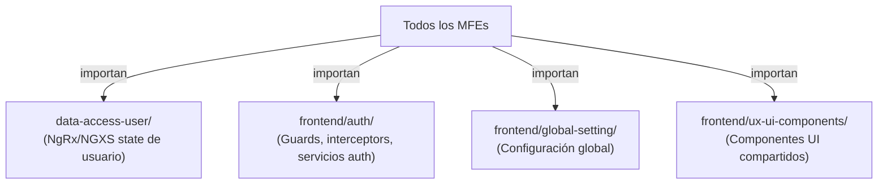

# Módulo: Shared

> **Ruta/Namespace:** `shared/`
> **Responsable histórico:** ⚠️ Pendiente de verificar
> **Criticidad:** 🟢 Baja (pero alta dependencia de todos los módulos)
> **Estado:** Activo

## Propósito

Librería de código compartido entre todos los microfrontends Angular de la plataforma. Contiene la lógica de autenticación compartida (`data-access-user`), componentes y utilidades de UI reutilizables, y configuraciones globales. Es consumida como importación directa por todos los MFEs.

## Funcionalidades que expone

| # | Funcionalidad | Descripción breve | Detalle |
|---|---|---|---|
| 1.1 | data-access-user | Estado y servicios de usuario autenticado | [[shared-data-access-user]] |
| 1.2 | frontend/auth | Guards y servicios de autenticación compartidos | [[shared-auth]] |
| 1.3 | frontend/global-setting | Configuraciones globales de la app | [[shared-global-setting]] |
| 1.4 | frontend/ux-ui-components | Componentes UI reutilizables | [[shared-ux-components]] |

## Dependencias

- **Depende de:** Ningún módulo interno
- **Es usado por:** [[modulo-main-shell]], [[modulo-auth]], [[modulo-descargas]], [[modulo-logistica]], [[modulo-oferta]], [[modulo-documentacion]], [[modulo-pedidos]], [[modulo-superapp]]
- **Consume servicios backend:** No directamente

## Diagrama de componentes internos

## Riesgos y deuda técnica detectados

- ⚠️ Cambios en `shared` impactan a todos los MFEs simultáneamente. Alta superficie de impacto por modificaciones.
- ⚠️ Sin información sobre si `data-access-user` y `shared/frontend/auth` están alineados o si hay lógica de autenticación duplicada.
- 🟢 Patrón correcto de shared library en monorepo Nx.

## Archivos fuente relevantes

- `shared/data-access-user/`
- `shared/frontend/auth/`
- `shared/frontend/global-setting/`
- `shared/frontend/ux-ui-components/`
