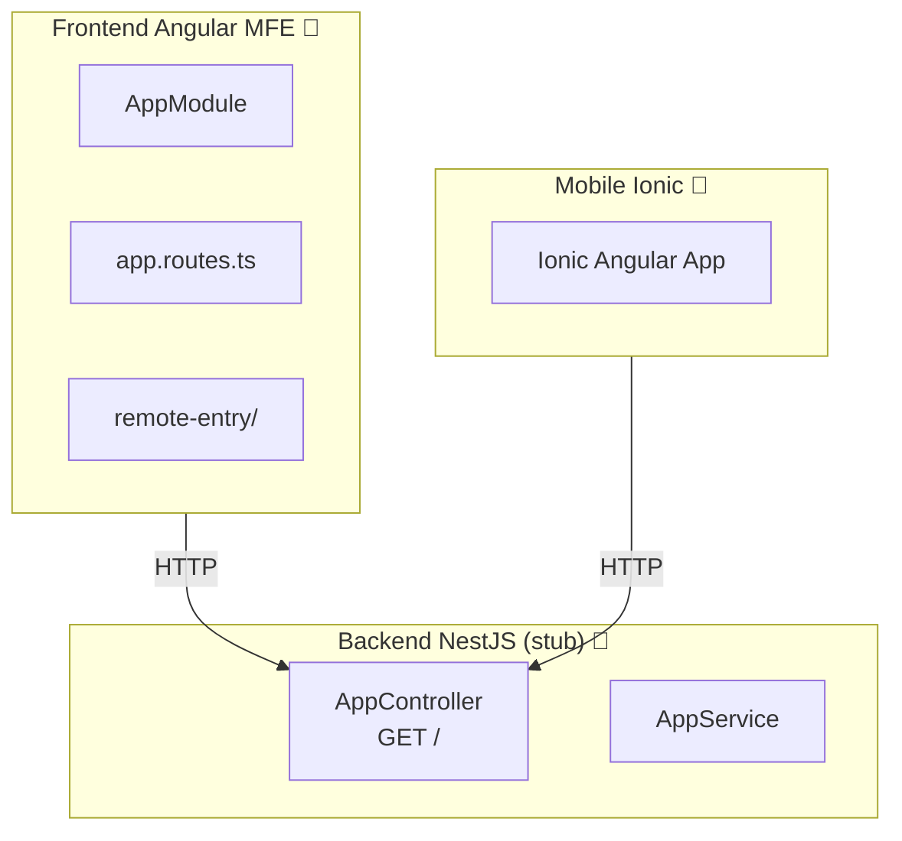

# Módulo: SuperApp

> **Ruta/Namespace:** `superapp/`
> **Responsable histórico:** ⚠️ Pendiente de verificar
> **Criticidad:** 🟡 Media
> **Estado:** En desarrollo (🚧)

## Propósito

Módulo en desarrollo que contempla un microfrontend Angular 16, una app mobile Ionic y un backend NestJS. Su propósito funcional específico no está documentado en el código fuente disponible (el backend es un stub básico). El nombre sugiere una aplicación de propósito general o un portal consolidado para múltiples funcionalidades.

## Funcionalidades que expone

| # | Funcionalidad | Descripción breve | Detalle |
|---|---|---|---|
| 1.1 | ⚠️ Pendiente | Funcionalidades por definir | 🚧 En desarrollo |
| 1.2 | Mobile SuperApp | App Ionic para acceso móvil | 🚧 En desarrollo |

## Dependencias

- **Depende de:** [[modulo-shared]], [[modulo-main-shell]]
- **Es usado por:** [[modulo-main-shell]] (como MFE remoto)
- **Consume servicios backend:** `superapp/backend` (NestJS — en desarrollo)

## Diagrama de componentes internos

## Servicios Backend Consumidos

> ⚠️ El backend es un stub. Solo tiene el endpoint de health check `GET /` generado por defecto.

## Entidades de datos implicadas

⚠️ Pendiente de definir.

## Riesgos y deuda técnica detectados

- 🔴 Backend en estado stub. No tiene lógica de negocio implementada.
- ⚠️ El propósito funcional del módulo no está definido en el código actual.
- ⚠️ La app mobile (`superapp/mobile`) requiere verificación de avance real.

## Archivos fuente relevantes

- `superapp/backend/src/app/app.module.ts`
- `superapp/backend/src/app/app.controller.ts`
- `superapp/backend/src/app/app.service.ts`
- `superapp/frontend/src/`
- `superapp/mobile/src/`
