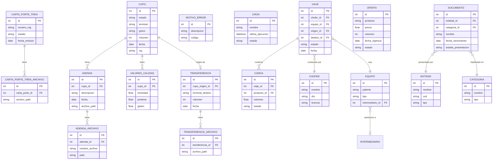

# Diagrama ER Global

> **Última revisión:** 2026-04-29
> **Nota:** Diagrama construido a partir de los modelos Sequelize de `descargas-app` y la inferencia de controladores Yii2. Requiere validación contra la base de datos real.

> ⚠️ Este diagrama es una aproximación basada en los modelos disponibles. Las relaciones exactas (claves foráneas, índices, nulabilidad) deben verificarse contra el esquema real de la DB o las migraciones.
