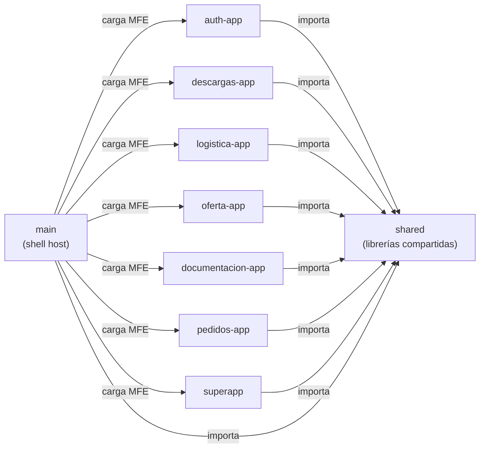

# Dependencias Cross-Módulo

> **Última revisión:** 2026-04-29

## Diagrama de Dependencias

## Explicación de Dependencias

### Dependencias de `shared`
Todos los MFEs importan `shared` como librería interna de Nx. Las dependencias son:
- `shared/data-access-user` — estado NGXS del usuario autenticado
- `shared/frontend/auth` — guards y servicios de autenticación
- `shared/frontend/global-setting` — configuración global
- `shared/frontend/ux-ui-components` — componentes UI reutilizables

### Dependencias del Shell (`main`)
El shell carga los MFEs en runtime mediante **Module Federation**. No importa código de los MFEs en tiempo de compilación (esa es la ventaja del patrón). La dependencia es de tipo _runtime remote loading_, no importación directa.

### Dependencias problemáticas detectadas

> [!warning] Vex theme duplicado
> El tema `@vex/` está copiado tanto en `main/src/@vex/` como en `auth-app/frontend/src/@vex/`. Esto genera duplicación de código y dificulta actualizaciones del tema. Debería estar centralizado en `shared/`.

> [!warning] OfertaController duplicado
> Existe un `OfertaController.php` en `logistica-app/backend/api/source/controllers/` y un backend dedicado en `oferta-app/`. No está claro si son independientes, si uno consume al otro, o si hay lógica de negocio duplicada.

> [!warning] Sin dependencias circulares detectadas
> No se detectaron dependencias circulares entre módulos en el análisis de la estructura de carpetas. Las librerías de `shared` no importan desde los módulos de aplicación (patrón correcto).

## Tipo de Dependencias

| Tipo | Descripción |
|---|---|
| **Importación directa** | Un módulo importa código TypeScript/Angular de otro mediante paths de Nx en `tsconfig.base.json` |
| **Runtime MFE** | El shell carga el MFE en runtime mediante `loadRemoteModule()` de Module Federation |
| **DB compartida** | ⚠️ Pendiente de verificar si los backends NestJS y Yii2 comparten la misma base de datos |
| **Archivo compartido** | `environments/` contiene archivos de entorno compartidos entre apps |
