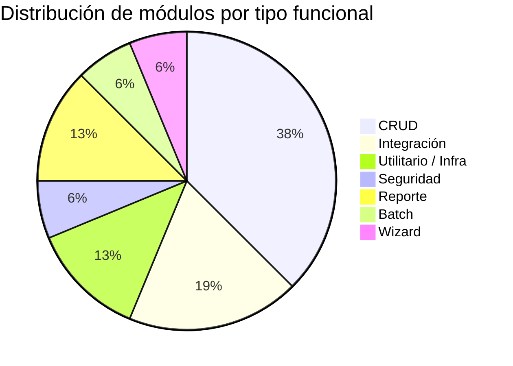

# Clasificación Funcional de Módulos

> **Última revisión:** 2026-04-29

## Tabla de Clasificación

| Módulo | Tipo Funcional | Descripción |
|---|---|---|
| `main` (shell) | Utilitario / Infraestructura | Host MFE, routing, layout global |
| `auth-app` | Seguridad | Login, sesión, guards de acceso |
| `shared` | Utilitario | Librerías compartidas, state management, UI components |
| `descargas-app` (frontend) | CRUD + Integración | Gestión de cupos, descargas, carta porte; integración AFIP |
| `descargas-app` (backend NestJS) | Integración + Batch | API REST, integración AFIP, cron jobs, reportes |
| `descargas-app` (reportes) | Reporte | Generación de Excel con ExcelJS |
| `descargas-app` (cron) | Batch | Tareas automáticas programadas |
| `descargas-app` (txt-upload) | Integración | Importación masiva desde archivos TXT |
| `logistica-app` (frontend) | CRUD | Viajes, cargas, choferes, equipos |
| `logistica-app` (backend Yii2) | CRUD | API REST PHP para logística |
| `oferta-app` (frontend) | CRUD + Reporte | Tablero de ofertas + gestión CRUD |
| `oferta-app` (backend Yii2) | CRUD | API REST PHP para ofertas |
| `documentacion-app` (frontend) | CRUD + Wizard | Carga y gestión documental con flujo de aprobación |
| `documentacion-app` (backend Yii2) | CRUD | API REST PHP para documentos |
| `pedidos-app` | CRUD | En desarrollo — gestión de pedidos |
| `superapp` | CRUD | En desarrollo — propósito por definir |

## Distribución por Tipo Funcional

## Observaciones

- **CRUD** es el tipo dominante, lo cual es consistente con una plataforma operativa.
- **Integración** es el segundo más representado, principalmente por la integración con AFIP en descargas.
- Los módulos **Pedidos** y **SuperApp** están en desarrollo; su clasificación puede cambiar.
- El tipo **Batch** se concentra en el `CronModule` de descargas, que ejecuta tareas programadas sobre cupos y carta porte.
