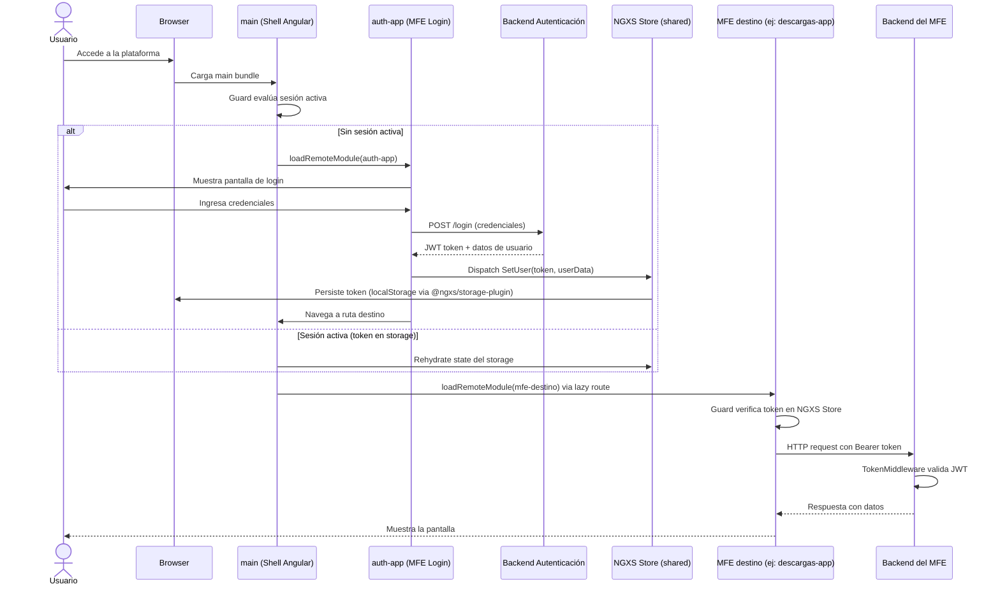

# Flujo: Autenticación y Acceso a MFE

> **Módulos involucrados:** [[modulo-auth]], [[modulo-main-shell]], [[modulo-shared]]
> **Tipo:** Flujo de seguridad / acceso

## Diagrama de Secuencia

## Notas

- ⚠️ El backend de `auth-app` es un stub. La autenticación real puede estar en el backend Yii2 de alguno de los módulos legacy o en un servicio externo. **Requiere verificación urgente.**
- El token JWT se persiste en `localStorage` via `@ngxs/storage-plugin`.
- Cada backend NestJS valida el JWT en `TokenMiddleware` (`forRoutes('*')`).
- Los backends Yii2 tienen su propio mecanismo de autenticación (`SiteController`) que puede no estar integrado con el mismo JWT.
